**Last Updated:** 2026-04-04

**Module Status:** Complete. All processes (4.1-4.10) implemented and tested, including Layer 2 ortholog mapping (Process 4.7).

**Pipeline Position:** [Input files] --> **Input validation & ID mapping** --> [Pre-normalization QC/EDA (Module 02), Normalization (Module 03)]

---

# 1. Purpose and Scope

This module is the entry point of the ProSIFT pipeline. It validates the user's input files (abundance matrix and metadata), cross-validates them against each other, maps all protein IDs to a standardized set of identifiers via UniProt, handles mapping edge cases (isoforms, unmapped IDs), and optionally performs mouse-to-human ortholog mapping for downstream database queries.

---

# 2. Inputs and Outputs

## 2.1 Inputs

**Abundance matrix:**

- Format: CSV or TSV (specified in params.yml as `input.format`)
- Rows: proteins (one per row)
- Columns: one protein ID column (name specified in params.yml as `input.protein_id_column`), then one column per sample containing abundance values, and optionally per-sample peptide count columns (see below)
- Protein IDs: UniProt accessions required in Phase 1. For protein group data where the ID column contains semicolon-delimited accessions, the first accession is used as the representative ID. Support for gene symbol or Ensembl ID input may be added in a future phase. See Decision Register entries 2026-03-23 "UniProt Accessions as Recommended Protein ID Type" and "Hardcode UniProt Accession Requirement for Phase 1" for rationale.
- Abundance values: can be raw intensities, normalized values, or log-transformed values (specified in params.yml as `input.abundance_type`)
- Missing values: represented as NA or empty cells
- Peptide count columns (optional but recommended): per-sample peptide counts used by DEqMS for variance modeling. Column names must follow the pattern `{prefix}{sample_id}` where the prefix is specified in params.yml as `input.peptide_count_prefix`. If absent, the statistical module falls back to limma (no peptide count weighting). See Decision Register entry 2026-03-23 "Peptide Counts in Abundance Matrix" for rationale.

**Metadata file:**

- Format: CSV or TSV (same format as abundance matrix)
- Rows: one per sample (sample IDs must match column headers in the abundance matrix, after stripping any abundance/peptide count prefixes)
- Columns: sample ID, condition/group column (name specified in params.yml as `design.group_column`), and any additional covariates specified in `design.covariates` or `design.batch_column`
- Must include at least two distinct groups in the group column

## 2.2 Outputs

*Updated 2026-03-27 to add missingness report visualizations (Process 4.10).*

- **Validated abundance matrix** (Parquet): the input matrix with confirmed structure and types, proteins passing detection filter, ready for downstream processing. Includes peptide count columns if provided.
- **Validated metadata** (Parquet): the input metadata with confirmed structure, matched to the matrix
- **ID mapping table** (Parquet): one row per input protein ID with columns for all target ID types (see Section 4.8 for schema)
- **Validation report**: summary of validation results, any warnings, unmapped ID counts, detection filter summary (proteins removed and why)
- **Missingness report** (HTML with interactive plots): visual characterization of missingness patterns across the full pre-filter dataset. Includes filter category bar chart, per-sample detection bar chart, missingness heatmap for filtered-out proteins, and per-protein missingness rate histogram. See Section 4.10 for details.

---

# 3. Workflow Diagram

{width=100%}

*Figure: Module-level workflow for input validation and ID mapping. Matrix and metadata validation run in parallel as independent Nextflow processes. Cross-validation joins both outputs. Detection filtering removes proteins with insufficient signal in the run context. ID mapping and ortholog mapping follow sequentially. Red tags indicate hard-stop error points. The ortholog mapping step is conditional (runs only when organism = mouse). Updated 2026-03-23 to add detection filter step and rename from "sub-workflow" to "workflow" to reserve the sub-workflow label for per-process detail diagrams.*

**Diagram hierarchy convention:** The master overview contains the full pipeline DAG. Each module document contains a workflow diagram showing the processes within that module and their dependencies. Individual processes may have sub-workflow diagrams showing internal logic (e.g., the detection filtering decision tree, the ID mapping cache-check flow) where the logic is complex enough to warrant visual documentation.

---

# 4. Process Specifications

## 4.1 Validate Matrix

**What it does:** Reads the abundance matrix file and checks structural integrity.

**Checks performed:**

- File exists and is readable
- File parses as valid CSV/TSV
- The specified protein ID column exists
- All abundance columns (identified by prefix matching, see `input.abundance_prefix`) contain numeric values (or NA/empty for missing)
- No duplicate protein IDs. For protein group data with semicolon-delimited accessions, the first accession is extracted and used as the representative ID; uniqueness is checked on these representative IDs.
- No completely empty rows or columns
- At least two proteins present
- If `input.peptide_count_prefix` is specified: verify that peptide count columns exist, are numeric (or zero/NA), and that the sample IDs embedded in the peptide count column names match those in the abundance columns

**Error behavior:** Hard stop with descriptive error message on any failure. No partial outputs.

## 4.2 Validate Metadata

**What it does:** Reads the metadata file and checks structural integrity.

**Checks performed:**

- File exists and is readable
- File parses as valid CSV/TSV
- The specified group column exists
- At least two distinct groups in the group column
- All specified covariate columns exist (if any)
- Batch column exists (if specified)
- No duplicate sample IDs

**Error behavior:** Hard stop with descriptive error message on any failure.

## 4.3 Cross-Validate Samples

**What it does:** Checks that the sample IDs in the metadata match the column headers in the abundance matrix.

**Checks performed:**

- Identify samples present in both files (the working set)
- Identify samples in the matrix but not in the metadata (will be dropped with warning)
- Identify samples in the metadata but not in the matrix (flagged as potential problem)
- Verify the working set has at least `qc.min_samples_per_group` samples in each group
- If no samples match, hard stop

**Output:** Validated matrix and metadata containing only the matched samples, plus a validation summary listing any dropped or missing samples.

**Error behavior:** Hard stop if no samples match or if any group has fewer samples than `qc.min_samples_per_group`.

## 4.4 Filter Low-Detection Proteins

*Added 2026-03-23 based on inspection of the CTX/Synaptosome dataset, where subsetting a globally-filtered dataset to individual region/fraction runs produces proteins with zero or near-zero detection in the subset.*

**What it does:** Removes proteins with insufficient detection across the samples in this run. This is a data quality filter, not a biological filter -- it removes proteins that cannot produce meaningful statistical results because they have too few observations.

**Why this step is needed:** Discovery proteomics datasets are often filtered globally (e.g., "detected in 3/3 replicates for at least one condition across all conditions in the experiment"). When a user subsets such a dataset for a focused comparison (e.g., one brain region, one subcellular fraction), some proteins pass the global filter only because they were detected in conditions not included in the subset. These proteins may be completely absent or sporadically detected in the run's samples. Without filtering, they would be entirely imputed, producing artificial fold changes and test statistics driven by the imputation method rather than by measured data. See Decision Register entry 2026-03-23 "Per-Run Detection Filtering in Validation Module" for full rationale.

**Filter logic:** A protein passes the detection filter if it is detected (non-missing abundance) in at least `qc.min_detections_per_group` replicates in at least one group. With the default of `qc.min_detections_per_group = 2` and typical triplicate designs, this requires detection in at least 2 of 3 replicates in at least one group.

**Categories reported in validation summary:**

- **Passed:** detected in >= `min_detections_per_group` replicates in all groups. Retained for downstream analysis.
- **Partial (passed):** detected adequately in one group but below threshold (non-zero but < `min_detections_per_group`) in the other. Retained because the passing group provides reliable data. The sub-threshold group has some signal but not enough for reliable group-level estimates; its missing values are imputed as MNAR. See Decision Register entry 2026-04-02 "Add PARTIAL Detection Filter Category".
- **Single-group detection (passed):** detected adequately in one group but completely absent (0 detections) in the other. These are potential presence/absence candidates. Retained, but flagged for the QC module to assess further.
- **Sparse (removed):** detected in fewer than `min_detections_per_group` replicates in all groups. Insufficient data for reliable statistical testing.
- **Absent (removed):** zero detections across all samples in the run. Completely uninformative for this comparison.

**Output:** Two outputs:

1. **Filtered abundance matrix** (Parquet): proteins passing the detection filter, ready for downstream processing.

2. **Detection filter summary table** (CSV): one row per input protein with columns for per-group detection counts and filter status (PASSED, PARTIAL, SINGLE-GROUP, SPARSE, ABSENT). Retained as a diagnostic artifact so users can verify what was removed and why.

The Process 4.4 section of the **validation report** includes two blocks. The report is designed to be self-contained -- readers should not need to consult the module documentation to interpret the output.

```
================================================================
DETECTION FILTER SUMMARY
================================================================

Filter threshold: min_detections_per_group = 2
  A protein passes if detected (non-missing) in at least 2 replicates
  in at least one group.

Category definitions:
  PASSED           - Detected in >= 2 replicates in both groups.
                     Sufficient data for reliable statistical testing.
  PARTIAL          - Detected in >= 2 replicates in one group
                     but below threshold (1 detection) in the other.
                     Retained: the sub-threshold group has some data
                     but not enough for reliable group-level estimates.
                     Missing values imputed as a mix of MNAR and MAR.
  SINGLE-GROUP     - Detected in >= 2 replicates in one group
                     but completely absent (0 detections) in the other.
                     Retained as potential presence/absence candidates.
                     Flagged for careful interpretation: the absent
                     group will be entirely imputed.
  SPARSE (removed) - Detected in < 2 replicates in ALL groups.
                     Insufficient data for reliable statistical testing
                     in any group.
  ABSENT (removed) - Zero detections across all samples in this run.
                     Protein was retained in the source dataset only
                     because it was detected in conditions not included
                     in this run.

Results:
  Input proteins:    8,948
  Passed:            8,542  (95.5%)
  Partial:              32  ( 0.4%)  [flagged]
  Single-group:        205  ( 2.3%)  [flagged]
  Sparse (removed):     55  ( 0.6%)
  Absent (removed):    114  ( 1.3%)
  --------------------------------
  Retained:          8,779  (98.1%)
  Removed:             169  ( 1.9%)

================================================================
PRE-FILTER MISSINGNESS OVERVIEW
================================================================

Total abundance values:  53,688  (8,948 proteins x 6 samples)
Missing values:           3,174  (5.9%)

Per-group detection rates:
  WT:  mean 8,414 detected (94.0%), range 8,289-8,509
  KO:  mean 8,458 detected (94.5%), range 8,368-8,572

Per-sample detection:
  CTXcyto_WT-1:  8,509 detected (95.1%),  439 missing (4.9%)
  CTXcyto_WT-2:  8,289 detected (92.6%),  659 missing (7.4%)
  CTXcyto_WT-3:  8,445 detected (94.4%),  503 missing (5.6%)
  CTXcyto_KO-1:  8,572 detected (95.8%),  376 missing (4.2%)
  CTXcyto_KO-2:  8,368 detected (93.5%),  580 missing (6.5%)
  CTXcyto_KO-3:  8,434 detected (94.3%),  514 missing (5.7%)
```

*(Numbers above are representative examples from the CTXcyto run. Actual values depend on the run.)*

The pre-filter missingness overview captures the data state before filtering. This is the only place it is recorded, since Module 02 (QC/EDA) operates only on post-filter data. See Decision Register entry 2026-03-25 "Missingness Overview in Module 01 Validation Report".

**Error behavior:** Warning if more than 20% of proteins are removed (suggests the input may not be appropriate for this run configuration). Hard stop if fewer than 50 proteins remain after filtering (insufficient data for meaningful analysis).

**Design note:** This filter operates on the raw missingness pattern in the abundance columns. It does not consider imputed values. It must run after cross-validation (because group assignments are needed to evaluate per-group detection) but before any normalization or imputation.

## 4.5 UniProt Bulk ID Mapping

**What it does:** Sends all protein IDs to UniProt's ID mapping API in a single bulk request. Returns a mapping table with target ID types.

**Process:**

1. Check if a valid cached mapping table exists (same input IDs, cache not expired per `databases.cache_days`)
2. If cache hit: load and return cached table
3. If cache miss: send bulk request to UniProt ID mapping API with source type from `input.protein_id_type` and target types (UniProt accession, gene symbol, Entrez ID, Ensembl gene)
4. Parse response into mapping table
5. Cache the mapping table as Parquet

**Why UniProt:** UniProt is the canonical protein database, maintains cross-references to all major biological identifier systems, and supports bulk mapping queries.

**Alternatives considered:** biomaRt (Ensembl-centric, less natural for protein-level data), local mapping files (large, staleness risk), g:Profiler (web service dependency).

## 4.6 Handle Mapping Edge Cases

**What it does:** Processes the raw UniProt mapping results to handle non-trivial cases.

**One gene symbol, multiple UniProt accessions (isoform collapse):** A single gene can produce multiple protein isoforms (splice variants), each with its own UniProt accession. The pipeline maps all isoforms to their canonical UniProt entry and flags these cases. Downstream modules that operate at the gene level (enrichment analysis, database queries) use the canonical entry. Isoform-level abundance data is retained for QC and differential abundance analysis.

**One UniProt accession, multiple gene symbols:** The pipeline uses the primary (recommended) gene symbol from UniProt and records alternatives in the mapping table as synonyms.

**Unmapped IDs:** Input IDs that cannot be mapped (obsolete accessions, non-standard identifiers, or contaminant accessions retaining search engine prefixes such as MaxQuant's `CON__` or DIA-NN's `C_` tags) are not silently dropped. They are logged, included in the QC report as unmapped, and carried through the pipeline with empty annotations. The user sees which proteins could not be mapped and can investigate.

**Secondary/merged accessions:** UniProt periodically merges entries or demotes accessions to secondary status. If the input contains an accession that is now secondary (typically because the search database FASTA was built from an older UniProt release), the API returns the current canonical accession. These cases are flagged `accession_redirected`. The abundance data remains keyed on the original `input_id`; the `uniprot_accession` column holds the canonical for all downstream annotation. This is distinct from isoform collapse (which is a biological relationship) -- accession redirection is a database-housekeeping artifact.

**Output:** Mapping status column with values: mapped, unmapped, isoform_collapsed, accession_redirected, multiple_mappings.

## 4.7 Ortholog Mapping (Conditional)

*Updated 2026-04-02. Layer 2 ortholog mapping implemented via Ensembl BioMart.*

**Condition:** Runs only when `project.organism` = "mouse" in params.yml.

**What it does:** Maps mouse Ensembl gene IDs to human ortholog gene symbols and Entrez IDs for downstream querying of human-centric databases (DGIdb, DisGeNET). Implemented as part of `bin/uniprot_mapping.py` (not a separate Nextflow process), running as a single bulk BioMart query after the UniProt mapping completes.

**Two-layer mapping:**

- **Layer 1:** Input protein IDs (mouse UniProt accessions) to mouse gene symbols, Entrez IDs, and Ensembl gene IDs. Source: UniProt ID mapping API (handled in Process 4.5).
- **Layer 2:** Mouse Ensembl gene IDs to human ortholog gene symbols and Entrez IDs. Source: Ensembl BioMart REST API. The primary join key is `ensembl_gene_mouse` (not gene symbol), because Ensembl IDs are unambiguous cross-references between organisms. Gene symbol fallback is used for the ~3.4% of proteins lacking an Ensembl gene ID from UniProt: these are queried separately by mouse gene symbol against BioMart's external gene name attribute.

**BioMart query implementation:**

- **Endpoint:** Ensembl BioMart REST API (`http://www.ensembl.org/biomart/martservice`), with automatic fallback to the US East mirror (`http://useast.ensembl.org/biomart/martservice`) on connection failure or timeout.
- **Dataset:** `mmusculus_gene_ensembl`
- **Attributes queried:** `ensembl_gene_id`, `external_gene_name` (mouse), `hsapiens_homolog_associated_gene_name` (human symbol), `hsapiens_homolog_ensembl_gene` (human Ensembl), `hsapiens_homolog_orthology_type` (one2one, one2many, many2many), `hsapiens_homolog_orthology_confidence` (0 or 1)
- **Query mode:** Single bulk XML query for all mouse Ensembl gene IDs in the run. BioMart returns one row per mouse-human ortholog pair.

**One-to-many ortholog handling:** When a mouse gene maps to multiple human orthologs, the highest-confidence ortholog is stored in the primary columns (`human_ortholog_symbol`, `human_ortholog_entrez`). All orthologs are recorded in the `mapping_notes` column (format: `orthologs: HUMAN1, HUMAN2, HUMAN3`). Confidence is ranked by: orthology_confidence = 1 over 0, then one2one over one2many over many2many.

**Version suffix stripping:** Ensembl gene IDs from UniProt sometimes include version suffixes (e.g., `ENSMUSG00000029580.18`). These are stripped to the base ID (e.g., `ENSMUSG00000029580`) before querying BioMart, which does not accept versioned IDs.

**Ortholog status tracking:** The mapping table `ortholog_mapping_status` column records one of: `one_to_one` (clear single ortholog), `one_to_many` (multiple human orthologs, best stored in primary columns), `no_ortholog` (no human ortholog found in BioMart). Proteins with no human ortholog will have null `human_ortholog_symbol` and `human_ortholog_entrez`. Since ProSIFT's primary use case is identifying candidates for human therapeutics, annotations from human-centric databases are presented without per-annotation flags. Proteins with no human ortholog have empty DGIdb and DisGeNET results, and the ortholog_mapping_status field explains why. (See project history Decision Register entry dated 2026-03-21 for full rationale.)

**PubMed queries** use both the mouse gene symbol and the human ortholog symbol, since relevant literature may use either. Results are labeled with which symbol generated the hit.

**CTXcyto benchmark results (2026-04-02):** 8,134 proteins with Ensembl gene IDs queried via BioMart. 97.0% one_to_one, 1.1% one_to_many, 1.9% no_ortholog. 269 proteins queried via gene symbol fallback (lacking Ensembl IDs from UniProt).

## 4.8 Mapping Table Output Schema

*Updated 2026-04-02 to reflect populated ortholog columns.*

The mapping module produces a single table (Parquet file) with one row per input protein ID:

- input_id: the original ID from the user's abundance matrix
- uniprot_accession: canonical UniProt accession
- gene_symbol_mouse: primary mouse gene symbol
- entrez_id_mouse: NCBI Entrez Gene ID (mouse)
- ensembl_gene_mouse: Ensembl gene ID (mouse)
- human_ortholog_symbol: human ortholog gene symbol (null if no ortholog found). Populated via Ensembl BioMart Layer 2 mapping.
- human_ortholog_entrez: human ortholog Entrez ID (null if no ortholog found). Populated via Ensembl BioMart Layer 2 mapping.
- ortholog_mapping_status: one of [one_to_one, one_to_many, no_ortholog, null]. Null when organism is not mouse or when the protein lacks an Ensembl gene ID and gene symbol fallback also fails.
- mapping_status: one of [mapped, unmapped, isoform_collapsed, accession_redirected, multiple_mappings]
- mapping_notes: free text for edge cases and diagnostics. Includes one-to-many ortholog alternatives when applicable (format: `orthologs: GENE1, GENE2, ...`).

Every downstream module reads this table and joins it with its input data to get the IDs it needs. The enrichment module uses gene_symbol_mouse. The PubMed module uses both gene_symbol_mouse and human_ortholog_symbol. DGIdb and DisGeNET use human_ortholog_entrez (and are skipped for proteins where it is null).

## 4.9 Cache Mapping Table

*Updated 2026-04-02 to reflect schema versioning.*

**What it does:** Writes the completed mapping table to Parquet and stores it in the cache directory. Subsequent runs with the same input IDs and unexpired cache will skip the API calls.

**Cache key:** Hash of sorted input protein IDs + source ID type + organism.

**Cache lifetime:** Configurable via `databases.cache_days` (default 30 days).

**Schema versioning:** The cache metadata JSON sidecar includes a `schema_version` field (current: v2, bumped from v1 when ortholog mapping was added). On cache load, if the stored schema version does not match the expected version, the cache is treated as a miss and the mapping is regenerated. This prevents stale cache files from being served when the mapping logic changes (e.g., new columns added, status values changed).

## 4.10 Missingness Report

*Added 2026-03-27. See Decision Register entry 2026-03-27 "Missingness Visualizations in Module 01" for rationale.*

**What it does:** Produces visual characterizations of missingness patterns across the full pre-filter dataset. This is a separate Nextflow process (MISSINGNESS_REPORT) that runs after FILTER_PROTEINS. It is a reporting-only step with no analytical logic and no effect on downstream data flow.

**Why a separate process:** The filtering script (`filter_proteins.py`) handles data transformation and the text-based validation report. Keeping the visualization in a separate script (`missingness_report.py`) preserves the filtering script's lean dependency profile (pandas/numpy only) and maintains separation between data processing and reporting. The visualization script depends on matplotlib, seaborn, and plotly, which are heavier libraries not needed by the filtering logic.

**Inputs:**

- `{run_id}.detection_filter_table.csv` (from FILTER_PROTEINS): one row per protein in the full pre-filter dataset, with per-group detection counts and filter status (PASSED, SINGLE-GROUP, SPARSE, ABSENT)
- `{run_id}.validated_matrix.parquet` (from VALIDATE_INPUTS): the full pre-filter abundance matrix, needed for per-sample detection counts and the missingness heatmap
- `{run_id}.validated_metadata.parquet` (from VALIDATE_INPUTS): sample-to-group assignments, needed for coloring plots by group

**Outputs:**

- `{run_id}.missingness_report.html`: standalone HTML file containing all four interactive plots (Plotly-based)
- `{run_id}.missingness_plots/`: directory containing static PNG versions of each plot for archival and documentation use

**Plots produced:**

**Plot 1: Filter category bar chart.** Four bars showing the number of proteins in each detection filter category (PASSED, SINGLE-GROUP, SPARSE, ABSENT). Bars annotated with counts and percentages. Provides an immediate visual summary of data completeness. Data source: `detection_filter_table.csv`, counting rows per `filter_status` value.

**Plot 2: Per-sample detection bar chart.** One bar per sample, height = number of proteins detected (non-missing) in that sample across the full pre-filter dataset. Bars colored by group. Samples within each group ordered consistently (e.g., replicate number). The plot subtitle shows the total input protein count as a denominator (e.g., "out of 8,847 total input proteins"), providing context for interpreting detection counts. Allows quick identification of outlier samples with unusually low detection counts relative to their group. Data source: `validated_matrix.parquet`, counting non-NaN abundance values per sample column. Group assignments from `validated_metadata.parquet`.

**Plot 3: Missingness heatmap (filtered-out proteins).** Rows = proteins that did NOT pass the detection filter (SINGLE-GROUP, SPARSE, and ABSENT categories). Columns = samples, grouped by condition. Cells colored binary: detected (colored) vs. missing (white/light). Proteins sorted by filter category, then by total detection count within each category. This shows the structure of the removed proteins: SINGLE-GROUP proteins appear as blocks of presence in one group and absence in the other, SPARSE proteins show scattered detections, and ABSENT proteins are entirely empty. Data source: join `detection_filter_table.csv` (to identify filtered-out proteins and their categories) with `validated_matrix.parquet` (to get per-sample presence/absence). Note: with ~400-500 filtered-out proteins for a typical CTX run, this heatmap is a manageable size. The plot includes category labels or dividers on the y-axis to visually separate the three filtered categories.

**Plot 4: Per-protein missingness rate histogram.** X-axis = fraction of samples missing (0/6, 1/6, 2/6, ..., 6/6 for a 6-sample run). Y-axis = number of proteins. Covers the full pre-filter dataset (all proteins, not just filtered-out ones). Shows the distribution of missingness across all proteins. A well-behaved dataset shows a strong peak at 0/6 (fully detected) with a smaller peak near 6/6 (absent). An unusual distribution (flat, multimodal, or heavy-tailed) may indicate systematic data quality issues. Data source: `validated_matrix.parquet`, computing the fraction of missing values per protein across all samples.

**Dependencies:** matplotlib, seaborn, plotly (all in the conda environment, not needed by other Module 01 scripts).

**Error behavior:** This process is advisory. If it fails (e.g., plotting library error), the pipeline should continue -- the downstream data flow does not depend on missingness report outputs. Implemented via Nextflow's `errorStrategy 'ignore'` or similar.

---

# 5. Design Decisions

*This section documents module-internal design decisions. Cross-cutting decisions that affect multiple modules (e.g., separate runs for factorial designs, ortholog tracking strategy, module architecture and numbering) are in the project history (`proSIFT_project_history.Rmd`) Decision Register (Section 1). Where a decision has both pipeline-level and module-level implications, each document covers its own level and cross-references the other.*

### 2026-03-23 -- Parallel Validation of Matrix and Metadata

**Decision:** Matrix validation and metadata validation run as separate parallel Nextflow processes rather than sequentially.

**Rationale:** The two files are independent -- neither validation step needs the other's output. Running them in parallel is a natural Nextflow pattern and is slightly faster. The cross-validation step that follows takes both validated outputs as input.

**Alternatives considered:** Sequential validation (validate matrix first, then metadata) -- simpler but unnecessarily serial.

**Impact:** Three processes instead of two in the validation sub-workflow, but the cross-validation step is the natural join point.

### 2026-03-23 -- Hard Stop on Validation Errors

**Decision:** The pipeline hard-stops on any validation error rather than attempting to continue with warnings.

**Rationale:** Garbage in, garbage out. Running statistical analyses on malformed input produces misleading results that are worse than no results. A hard stop with a clear error message forces the user to fix their input, which is faster than debugging mysterious downstream failures.

**Alternatives considered:** (1) Warn and continue -- rejected because partial processing of invalid data creates ambiguity. (2) Warn for minor issues, stop on critical -- reasonable but adds complexity in classifying what's "minor" vs. "critical." Deferred to a later refinement.

**Impact:** Users see immediate, clear errors when input is malformed.

### 2026-03-23 -- Hardcode UniProt Accession Requirement for Phase 1

**Decision:** Drop the `input.protein_id_type` parameter for Phase 1. The pipeline requires UniProt accessions as input. Support for gene symbol or Ensembl ID input may be added in a future phase. This supersedes the earlier same-date decision "Explicit ID Type Specification (No Auto-Detection)" which kept the parameter.

**Rationale:** Standard proteomics practice is to search against UniProt FASTA databases, meaning search engine output (DIA-NN, MaxQuant, FragPipe, Spectronaut, Proteome Discoverer, PEAKS) almost universally contains UniProt accessions. The search engine reports whatever identifiers are in the FASTA; the FASTA is almost always from UniProt. Edge cases where non-UniProt IDs appear (RefSeq or Ensembl-derived databases, custom databases, legacy tools) are uncommon enough that building and testing the branching logic for them in Phase 1 is not justified. The ID mapping module architecture supports multiple source types internally, so adding the parameter later does not require a redesign -- only re-exposing a configuration option and adding the corresponding UniProt API query paths.

**Alternatives considered:** (1) Keep the parameter but validate only "uniprot" in Phase 1, returning a "not yet supported" error for other values -- forward-looking but adds dead code and a parameter that does nothing useful yet. (2) Keep the parameter fully functional with gene symbol and Ensembl support -- over-engineering for Phase 1 given the near-universal UniProt convention.

**Impact:** `input.protein_id_type` removed from params.yml. Input spec (Section 2.1) updated to state UniProt accessions are required. Validate Matrix (4.1) assumes UniProt format. The ingestion scripts (Section 9) always extract UniProt accessions from search engine output.

### 2026-03-23 -- UniProt Accessions as Recommended Protein ID Type

**Decision:** UniProt accessions are the required protein ID type for ProSIFT input in Phase 1. When input contains protein group data with semicolon-delimited accessions, the first accession is extracted as the representative ID.

**Rationale:** Data-driven decision based on inspection of the CTX/Synaptosome dataset (Filtered Proteins-Table 1.csv, 8,948 proteins from DIA-NN output). Key findings:

- The Protein Group column contains semicolon-delimited UniProt accessions. 90.1% of rows have a single accession; 9.9% have multi-member groups (2-11 accessions). Taking the first accession produces 8,948 unique IDs with zero duplicates, making it immediately usable as a primary key.
- The Genes column (gene symbols) has 240 duplicated gene symbols affecting 518 rows (5.8% of the dataset). This occurs because DIA-NN reports distinguishable protein groups separately even when they map to the same gene (e.g., Ank2 has 6 rows representing different isoform groups with distinct peptide evidence). Using gene symbols as the protein ID would trigger ProSIFT's duplicate ID validation error, requiring the user to pre-aggregate isoforms before input -- a non-trivial decision that should not be forced at the input stage.
- UniProt accessions are the most direct input for ProSIFT's ID mapping module (UniProt-to-UniProt mapping is near-trivial; gene-symbol-to-UniProt is more error-prone). They are unambiguous across organisms, stable over time (unlike gene symbols which can change), and not susceptible to Excel auto-formatting corruption (unlike gene symbols such as MARCH1, SEPT1, DEC1 which Excel converts to dates).

**Alternatives considered:** Gene symbols -- rejected as primary ID due to the duplicate problem documented above. Gene symbols remain available as a downstream mapping target via the ID mapping module. Ensembl IDs -- viable but less common in proteomics output than UniProt accessions.

**Impact:** Documentation updated to require UniProt accessions in Phase 1. Validate Matrix process (4.1) updated to handle semicolon-delimited protein group entries by extracting the first accession.

### 2026-03-23 -- Retain input.abundance_type as Parameter

**Decision:** Keep `input.abundance_type` (raw/log2/normalized) as a configurable parameter rather than hardcoding "raw."

**Rationale:** Unlike protein ID type (where UniProt accessions are near-universal), the state of abundance data genuinely varies across use cases. A user might want to feed ProSIFT pre-normalized data (trusting their core facility's normalization and wanting only the annotation layer), or log2-transformed data. The pipeline needs to know the data state so it can skip or adjust steps accordingly -- log-transforming already log-transformed data or normalizing already normalized data would produce incorrect results. While the primary use case is raw input (ProSIFT handles normalization and imputation itself), the parameter costs almost nothing to maintain and prevents a class of silent errors.

**Alternatives considered:** Hardcode "raw" like protein ID type -- rejected because the consequence of getting this wrong (double-normalization, double-log-transformation) is silent corruption of results rather than an obvious error. The parameter is a safety valve.

**Impact:** Parameter retained in params.yml. The normalization and imputation modules (not yet designed) will need to check this value and adjust their behavior accordingly.

### 2026-03-23 -- Separate Runs for Multi-Condition Factorial Designs

**Decision:** For datasets with factorial designs (e.g., the CTX/Synaptosome 2x2x2 design: genotype x region x fraction), the recommended approach is separate ProSIFT runs per comparison context rather than a single combined run. For the CTX dataset, this means 4 runs (CTXcyto, CTXsynap, HIPcyto, HIPsynap), each a simple two-group KO vs WT comparison with 6 samples.

**Rationale:** The decision involves a genuine statistical tradeoff between cleaner assumptions (separate runs) and greater statistical power (combined run), with implications across normalization, imputation, differential abundance, and enrichment. See project history (`proSIFT_project_history.Rmd`) Decision Register entry 2026-03-23 "Separate Runs for Factorial Designs" for the full tradeoff analysis.

**Module 01 impact:** The data preparation scripts (Section 9) implement this strategy by allowing users to define multiple runs from a single source file. Each run produces its own abundance matrix, metadata, and params.yml. The detection filter (Process 4.4) operates per-run, which is why subsetting reveals proteins that are absent or sparse within a run's samples despite passing a global filter. ProSIFT's current two-group input design is sufficient for separate runs; multi-group support is deferred to Phase 2+.

### 2026-03-23 -- Two-Script Data Preparation Architecture

**Decision:** Data preparation (converting search engine output to ProSIFT input format) is handled by two scripts: `generate_run_config.py` (interactive setup tool that produces a YAML run definition) and `prepare_prosift_input.py` (workhorse that reads the YAML and produces ProSIFT input files). See Section 9 for full specification.

**Rationale:** The two concerns -- understanding the source data structure and defining runs (experiment-specific, done once) vs. extracting and reformatting the data (generic, potentially re-run) -- have different interaction models and reuse profiles. The YAML config file serves as the contract between them: it captures experiment-specific decisions (which samples, which groups, which prefixes) so the extraction script stays generic. The config file also serves as documentation of exactly how the data was prepared.

**Alternatives considered:** (1) Single self-contained script -- simpler but mixes experiment-specific decisions with generic parsing logic, making it harder to reuse for different datasets. (2) Single script with a YAML config file -- similar separation of concerns but loses the guided setup experience that helps users identify column prefixes and define runs correctly. (3) A fully argument-driven approach -- faster for experienced users but less discoverable for new users encountering unfamiliar column structures.

**Impact:** Two scripts to develop and maintain. The YAML config format is a precursor to what ProSIFT's eventual built-in ingestion modules would accept.

### 2026-03-23 -- Source Annotations as Separate Reference File

**Decision:** Gene symbols and protein descriptions from the source search engine output are written to a separate reference file (`{run}_protein_reference.csv`) rather than included in the ProSIFT abundance matrix or discarded entirely.

**Rationale:** These annotations are useful for human convenience (reading accession Q8C8R3-3 means nothing; reading Ank2/Ankyrin-2 is immediately informative) and for cross-checking ProSIFT's ID mapping (verifying that the pipeline's UniProt mapping agrees with what the search engine reported). However, they do not belong in the abundance matrix because: (a) ProSIFT's input spec defines the abundance matrix as protein ID + abundance columns + optionally peptide count columns, and extra columns would either fail validation or require a mechanism for "pass-through columns the pipeline ignores"; (b) ProSIFT generates its own annotations from UniProt, so the source annotations are redundant and potentially stale (the search FASTA may be older than the current UniProt release); (c) having two sources of truth for gene symbols creates ambiguity.

**Alternatives considered:** (1) Include in the abundance matrix as extra columns -- rejected because it complicates validation and creates dual annotation sources. (2) Discard entirely -- rejected because the debugging and cross-checking value is real, especially during pipeline development.

**Impact:** The `prepare_prosift_input.py` script writes a `{run}_protein_reference.csv` alongside each run's input files. This file is not a ProSIFT input; it is a human convenience artifact.

### 2026-03-23 -- Per-Run Detection Filtering in Validation Module

**Decision:** Build a per-run detection filter into the validation module (Process 4.4) rather than requiring users to pre-filter their input or relying solely on downstream QC flagging.

**Rationale:** When users subset a globally-filtered proteomics dataset for a focused comparison (e.g., one brain region or subcellular fraction from a multi-condition experiment), some proteins pass the global filter only because they were detected in conditions not included in the subset. Inspection of the CTX/Synaptosome dataset confirmed this is a real concern: subsetting to individual region/fraction runs (6 of 24 samples each) produces 114-322 proteins with zero detection and 55-96 proteins with sparse detection per run (1.9-4.7% of the 8,948 total). These proteins would be entirely or near-entirely imputed, producing artificial differential abundance results driven by the imputation method rather than measured data.

The filter belongs in the validation module rather than in an external preprocessing script because: (a) it requires knowledge of group assignments (from the metadata file) to evaluate per-group detection rates, which means it must run after cross-validation; (b) it is a data quality check that benefits all users, not just those with subset data; (c) placing it inside the pipeline keeps the preprocessing step documented and reproducible rather than hidden in ad-hoc scripts.

**Alternatives considered:** (1) Pre-filter in an extraction script -- quicker to implement but creates a preprocessing step outside the pipeline that is not documented or reproducible within the pipeline's own audit trail. (2) Feed all proteins and rely on downstream QC flagging -- the QC module would flag these proteins, but they would still flow through normalization and imputation, potentially influencing those steps (e.g., proteins with extreme missingness can affect quantile normalization reference distributions). (3) Hybrid approach (unfiltered test runs + filtered production runs) -- useful for pipeline validation but not a general-purpose solution.

**Impact:** New process (4.4) added to the workflow between cross-validation and ID mapping. New parameter: `qc.min_detections_per_group` (default 2). Workflow diagram updated. Detection filter summary included in validation report output. The detection_filter_table.csv output is also consumed by Module 03 (Imputation) for MNAR/MAR classification; see project history (`proSIFT_project_history.Rmd`) Decision Register entry 2026-03-23 "Per-Run Detection Filter in Validation Module" for the cross-module impact.

### 2026-03-23 -- Peptide Counts Included in Abundance Matrix File

**Decision:** Per-sample peptide count columns are included in the abundance matrix file alongside the abundance columns, identified by a configurable column name prefix. They are optional: if absent, the statistical module falls back to limma instead of DEqMS.

**Rationale:** DEqMS, ProSIFT's preferred method for differential abundance analysis, requires per-protein peptide counts to model the relationship between measurement precision and the number of quantifying peptides. Without peptide counts, DEqMS cannot be used and the pipeline falls back to limma, which treats all proteins as equally precisely measured regardless of how many peptides support each quantification. The CTX/Synaptosome dataset includes per-sample stripped sequence counts (24 columns in the Filtered Proteins sheet), confirming that this data is available in typical DIA-NN output and worth preserving through the pipeline.

Including peptide counts in the same file as abundances (rather than a separate file) keeps the input simple: one abundance matrix file, one metadata file. The columns are distinguished by prefix (`input.abundance_prefix` and `input.peptide_count_prefix`), which the validation module uses to parse the file into its component parts.

**Alternatives considered:** (1) Separate peptide count file -- cleaner separation of concerns but adds a third required input file, increasing the chance of mismatched files and user error. (2) Single summary peptide count per protein (e.g., total unique peptides) rather than per-sample -- simpler but loses the per-sample information that DEqMS can use for more precise variance modeling. Per-sample counts are available in most search engine outputs, so there is no reason to discard them. (3) No peptide count support -- rejected because it would make DEqMS unusable, removing ProSIFT's primary advantage over generic differential expression tools.

**Impact:** Input spec (Section 2.1) updated to include peptide count columns. Validate Matrix process (4.1) updated to check peptide count columns when the prefix is specified. New parameters: `input.abundance_prefix`, `input.peptide_count_prefix`. The statistical module (Module 02, not yet designed) will need to consume these columns and pass them to DEqMS.

### 2026-03-25 -- Missingness Overview in Module 01 Validation Report

**Decision:** The validation report includes a missingness overview that captures the pre-filter state of the data, even though Module 02 (QC/EDA) operates only on post-filter data.

**Rationale:** Detection filtering runs in Module 01 (Process 4.4) because it requires group assignments to evaluate per-group detection rates. This means Module 02 QC/EDA never sees the raw data state -- its missingness analysis characterizes sporadic missingness among retained proteins, not the overall dataset. To ensure the pre-filter data state is documented and reviewable, the validation report includes a summary of protein counts by filter category (absent, sparse, single-group detection, passed) and per-group detection rates before filtering occurs.

**Alternatives considered:** (1) Move detection filtering to Module 02 -- rejected because the filter requires group assignments from metadata validation, and placing it in Module 02 blurs the responsibility boundary between validation and QC. (2) Pass pre-filter matrix to Module 02 alongside post-filter matrix -- adds complexity and an extra data file for a one-time overview that fits naturally in the validation report.

**Impact:** Process 4.4 output spec updated (Section 4.4) to include the missingness overview fields in the validation report. No new parameters needed.

### 2026-03-25 -- Detection Filter Parameter Changed from Fraction to Integer

**Decision:** Replace `qc.min_detection_fraction` (float, default 0.67) with `qc.min_detections_per_group` (integer, default 2). The parameter now specifies an absolute replicate count rather than a fraction.

**Rationale:** With a typical triplicate design (n=3 per group), the intended threshold of "2 out of 3 replicates" is represented as the fraction 0.67. But `2/3 = 0.6667`, which is less than 0.67, so the filter `detected_count / n >= 0.67` would incorrectly exclude proteins detected in exactly 2 of 3 replicates -- the very case the threshold is meant to pass. Using an integer eliminates this floating-point edge case entirely: `detected_count >= 2` is exact, unambiguous, and directly readable.

**Alternatives considered:** (1) Lower the float threshold to 0.666 or 0.6 to avoid the edge case -- would work for n=3 but creates different edge cases for other n values (e.g., n=4: `2/4 = 0.5 >= 0.6` is false, but `3/4 = 0.75 >= 0.6` is true, which may not be the intended behavior). (2) Keep the fraction but document the edge case -- defers the problem to users and is hard to notice without inspecting data closely. The integer parameterization is unambiguous regardless of group size.

**Impact:** Parameter renamed and type changed. All existing `params.yml` files regenerated. Module 01 documentation updated throughout (filter logic description, parameter table, validation report format block, category definitions, testing notes).

### 2026-03-27 -- Missingness Visualizations in Module 01 (New MISSINGNESS_REPORT Process)

**Decision:** Add a new Nextflow process (MISSINGNESS_REPORT) to Module 01 that produces visual characterizations of missingness patterns. This is a separate process from FILTER_PROTEINS, implemented as `bin/missingness_report.py`. Four plots are produced: (1) filter category bar chart, (2) per-sample detection bar chart colored by group, (3) missingness heatmap for filtered-out proteins (Option A: SINGLE-GROUP, SPARSE, and ABSENT proteins only), (4) per-protein missingness rate histogram across the full dataset.

**Rationale:** During Module 02 (QC/EDA) design, a systematic inventory of QC analyses revealed that missingness characterization belongs in Module 01 rather than Module 02, for two reasons. First, Module 01's detection filter (Process 4.4) already removes the proteins with the most dramatic missingness patterns (SINGLE-GROUP, SPARSE, ABSENT). By the time Module 02 sees the data, per-protein missingness is limited to at most 1-2 missing values out of 6 (for the default threshold of 2 detections per group with triplicate designs). The substantive missingness story is in the pre-filter data, which only Module 01 has access to. Second, Module 01 already computes all the data needed for these visualizations (detection_filter_table.csv, per-sample counts in the text report); the only missing piece is the visual presentation.

The MISSINGNESS_REPORT is a separate process rather than additions to `filter_proteins.py` to keep the filtering script lean (no matplotlib/seaborn/plotly dependency) and maintain separation between data processing and reporting.

The missingness heatmap uses Option A (filtered-out proteins only, ~400-500 proteins per CTX run) rather than the full dataset (~8,900 proteins) because the full heatmap would be visually unreadable at that scale and the interesting missingness patterns (structured absence, sparse detection) are concentrated in the filtered-out proteins.

**Alternatives considered:** (1) Add missingness visualizations to Module 02 (QC/EDA) -- rejected because Module 02 operates on post-filter data where the dramatic missingness patterns have already been removed, making the analysis largely redundant. (2) Add plots directly to `filter_proteins.py` -- rejected because it would add matplotlib/seaborn/plotly as dependencies to a script that currently needs only pandas/numpy, and would mix data transformation with reporting. (3) Full-dataset missingness heatmap -- rejected because ~8,900 rows is unreadable; the filtered-out proteins are where the structure is. (4) Group-specific detection scatter/bubble chart (per-protein detections in group A vs. group B) -- considered but deferred as lower priority; the heatmap conveys the same structural information more directly.

**Impact:** New process added to Module 01 workflow (MISSINGNESS_REPORT). New script: `bin/missingness_report.py`. New outputs: `{run_id}.missingness_report.html` and `{run_id}.missingness_plots/` directory with static PNGs. No new parameters (all visualization choices are hardcoded; the plots use data already produced by FILTER_PROTEINS). Module 02 (QC/EDA) scope confirmed as excluding missingness analysis. See also project history (`proSIFT_project_history.Rmd`) Decision Register entry 2026-03-27 "Missingness Visualizations Assigned to Module 01 (Not Module 02)" for the pipeline-level scope assignment rationale.

---

# 6. Parameters

*Updated 2026-03-23 to add abundance/peptide count prefix parameters, detection filter threshold, and remove `input.protein_id_type` (hardcoded to UniProt for Phase 1).*

The following params.yml fields control this module:

| Parameter | Type | Default | Description |
|---|---|---|---|
| `input.abundance_matrix` | string | (required) | Path to abundance matrix file |
| `input.metadata` | string | (required) | Path to metadata file |
| `input.format` | string | "csv" | File format: csv or tsv |
| `input.protein_id_column` | string | "protein_id" | Column name containing protein IDs (UniProt accessions) |
| `input.abundance_type` | string | "raw" | Data state: raw, log2, or normalized. Controls whether the pipeline applies normalization and/or log transformation. See Decision Register entry 2026-03-23 "Retain input.abundance_type as Parameter." |
| `input.abundance_prefix` | string | "" | Prefix on abundance column names (e.g., "Abundance " to match "Abundance CTXcyto_WT-1"). Empty string means column names are bare sample IDs. |
| `input.peptide_count_prefix` | string | null | Prefix on peptide count column names (e.g., "Stripped Sequence Count "). If null, no peptide counts are expected and DEqMS falls back to limma. |
| `design.group_column` | string | "condition" | Column in metadata defining groups. Name varies across datasets (e.g., "genotype", "treatment", "group"), so this must be specified by the user. |
| `design.covariates` | list | [] | Covariate column names |
| `design.batch_column` | string | null | Batch column name |
| `project.organism` | string | "mouse" | Organism: mouse or human |
| `qc.min_samples_per_group` | int | 2 | Minimum samples per group |
| `qc.min_detections_per_group` | int | 2 | Minimum number of replicates in at least one group where a protein must be detected (non-missing) to pass the detection filter. Default 2 requires detection in at least 2 replicates. Set to 0 to disable. |
| `databases.cache_days` | int | 30 | ID mapping cache lifetime in days |

---

# 7. Known Limitations and Edge Cases

- **Mixed ID types:** If the abundance matrix contains a mix of ID types (e.g., some UniProt accessions and some gene symbols), the pipeline will fail to map a subset. Users must clean their input to use a single ID type.
- **Protein groups with multiple accessions:** Multi-member protein groups (semicolon-delimited accessions in the protein ID column) are handled by taking the first accession as the representative ID. This discards information about which other proteins are indistinguishable by peptide evidence. The first accession is typically the canonical/best-scoring entry as reported by the search engine (confirmed for DIA-NN output), but this convention may differ across search engines. Users should verify that their search engine lists the preferred accession first.
- **Gene symbol duplicates in protein group data:** DIA-NN and other search engines can report multiple protein groups mapping to the same gene symbol when isoforms or fragments have distinguishing peptide evidence. In the CTX/Synaptosome dataset, 240 gene symbols are duplicated across 518 rows (5.8% of 8,948 proteins). This makes gene symbols unsuitable as a unique protein ID for ProSIFT input without prior aggregation. Users who must use gene symbols should collapse protein groups to unique gene symbols before input.
- **Contaminant proteins:** Common contaminants (keratins, BSA, trypsin) have valid UniProt accessions and will map successfully if their accessions are clean. However, some search engines prefix contaminant accessions with non-standard tags (e.g., MaxQuant's `CON__P02769`, DIA-NN's `C_` prefix) that are not valid UniProt identifiers and will fail to map. Users should remove contaminants during upstream processing (standard practice) or strip search-engine-specific prefixes before input. The pipeline does not automatically detect or remove contaminants.
- **Deprecated UniProt accessions:** Accessions that have been merged or deleted in UniProt will fail to map. The mapping module flags these as unmapped rather than attempting to resolve them. This is a concern when the reference database used for the search (e.g., UP000000590 downloaded 2025-04-25) is older than the current UniProt release.
- **Ortholog mapping coverage:** In the CTXcyto benchmark, 97.0% of mouse proteins have a one-to-one human ortholog, 1.1% have one-to-many mappings (highest-confidence stored in primary columns, alternatives in `mapping_notes`), and 1.9% have no human ortholog. Proteins with no ortholog will have empty DGIdb and DisGeNET results. One-to-many cases use the highest-confidence ortholog for querying, which may not always be the functionally relevant one.
- **Detection filter and biological presence/absence:** The per-run detection filter (Section 4.4) retains proteins detected in only one group (e.g., present in WT, absent in KO) because these are potential biological hits. However, the statistical reliability of these proteins is inherently limited -- the "absent" group values will be entirely imputed. The QC module should flag these for careful interpretation downstream.

---

# 8. Testing Notes

*[To be populated during implementation.]*

**Structural validation tests:**

- Test with a clean input file (all IDs map, all samples match) -- verify correct mapping table
- Test with mismatched sample IDs -- verify hard stop with clear error
- Test with duplicate protein IDs -- verify hard stop
- Test with semicolon-delimited protein group IDs -- verify first accession extraction and uniqueness check
- Test with gene symbol input containing duplicates -- verify hard stop with informative error message

**ID mapping tests:**

- Test with unmappable IDs -- verify they are flagged, not dropped
- Test with isoform-level UniProt IDs (e.g., Q8K1M6-14) -- verify collapse to canonical entries
- Test cache behavior -- verify cache hit on re-run, cache miss after expiry

**Detection filter tests (using CTX/Synaptosome data as reference):**

- Test CTXcyto subset (6 samples from 24): expect ~169 proteins removed (~1.9%), ~8,779 retained
- Test HIPcyto subset (6 samples from 24): expect ~418 proteins removed (~4.7%), ~8,530 retained -- highest removal rate due to known HIPcyto missingness
- Verify proteins with 0/6 detection are classified as "absent (removed)"
- Verify proteins with adequate detection in one group but zero in the other are classified as "single-group detection (passed)" and retained
- Verify proteins with 1/3 detection in both groups are classified as "sparse (removed)"
- Test with `qc.min_detections_per_group = 0` -- verify all proteins retained (filter disabled)

**Peptide count tests:**

- Test with peptide count columns present -- verify correct parsing and pass-through
- Test without peptide count columns (prefix = null) -- verify graceful fallback, no errors

---

# 9. Data Preparation Scripts

*Added 2026-03-23. These scripts are not part of the ProSIFT pipeline itself -- they are preprocessing tools that convert search engine output into ProSIFT's expected input format. They are the seed of what would eventually become ProSIFT's built-in ingestion modules.*

## 10.1 Overview

Two scripts convert proteomics search engine output into ProSIFT-format input files:

**Script 1: `generate_run_config.py`** -- Interactive setup tool. Reads a search engine output CSV, guides the user through identifying columns and defining runs, and outputs a YAML run definition file.

**Script 2: `prepare_prosift_input.py`** -- Workhorse extraction tool. Reads the source CSV + the YAML run definition from Script 1, and produces ProSIFT-format abundance matrices, metadata files, draft params.yml files, and protein reference files for each defined run.

The YAML run definition file is the contract between the two scripts. It captures all experiment-specific decisions (which samples belong to which run, which group each sample maps to, which column prefixes to use) so that Script 2 remains generic and reusable.

## 10.2 Script 1: generate_run_config.py

**Purpose:** Inspect a proteomics search engine output file, identify the column structure, and generate a run definition YAML config.

**Dependencies:** PyYAML, standard library.

**Invocation:** `python generate_run_config.py --input Filtered_Proteins-Table_1.csv`

**Interactive walkthrough (5 steps):**

```
============================================================
ProSIFT Run Configuration Generator
============================================================
Source file: Filtered_Proteins-Table_1.csv
Columns detected: 178

--- Step 1: Protein ID Column ---
Found these candidate ID columns (non-numeric, first 7 columns):
  [1] Num
  [2] Protein Group
  [3] Modified Sequence Count
  [4] Stripped Sequence Count
  [5] Protein Names
  [6] Genes
  [7] First Protein Description

Which column contains protein IDs? [2]:
> 2

Using "Protein Group" as protein ID column.
  8,948 unique proteins (first accession from semicolon-delimited groups).

--- Step 2: Column Prefixes ---
Detected column prefixes:
  [1] "Abundance "                 (24 columns)
  [2] "Norm Abundance "            (24 columns)
  [3] "Log2 Norm Abundance "       (24 columns)
  [4] "Stripped Sequence Count "    (24 columns)
  [5] "Modified.Seq.Count "        (24 columns)
  [6] Other (comparison stats, etc.)

Which prefix contains the raw abundance data? [1]:
> 1

Include peptide counts? [y/n]: y
Which prefix contains peptide counts? [4]:
> 4

--- Step 3: Sample Identification ---
Found 24 samples:
  CTXcyto_WT-1    CTXcyto_WT-2    CTXcyto_WT-3
  CTXcyto_KO-1    CTXcyto_KO-2    CTXcyto_KO-3
  CTXsynap_WT-1   CTXsynap_WT-2   CTXsynap_WT-3
  CTXsynap_KO-1   CTXsynap_KO-2   CTXsynap_KO-3
  HIPcyto_WT-1    HIPcyto_WT-2    HIPcyto_WT-3
  HIPcyto_KO-1    HIPcyto_KO-2    HIPcyto_KO-3
  HIPsynap_WT-1   HIPsynap_WT-2   HIPsynap_WT-3
  HIPsynap_KO-1   HIPsynap_KO-2   HIPsynap_KO-3

--- Step 4: Define Runs ---

How many runs? 4

--- Run 1 ---
Run name: CTXcyto
Assign samples by number (comma-separated): 1,2,3,4,5,6

Samples in run "CTXcyto":
  1. CTXcyto_WT-1    2. CTXcyto_WT-2    3. CTXcyto_WT-3
  4. CTXcyto_KO-1    5. CTXcyto_KO-2    6. CTXcyto_KO-3

Now assign groups. Enter group names (these become values
in the metadata group column).
How many groups? 2

Group 1 name: WT
Assign samples to "WT" by number (from this run's samples): 1,2,3

Group 2 name: KO
Assign samples to "KO" by number (from this run's samples): 4,5,6

Run "CTXcyto" summary:
  WT: CTXcyto_WT-1, CTXcyto_WT-2, CTXcyto_WT-3
  KO: CTXcyto_KO-1, CTXcyto_KO-2, CTXcyto_KO-3
Correct? [y/n]: y

--- Run 2 ---
Run name: CTXsynap
Assign samples by number (comma-separated): 7,8,9,10,11,12
...

[Runs 3-4 follow the same pattern]

--- Step 5: Review ---

Unassigned samples: none

Run summary:
  CTXcyto:  3 WT, 3 KO  (6 samples)
  CTXsynap: 3 WT, 3 KO  (6 samples)
  HIPcyto:  3 WT, 3 KO  (6 samples)
  HIPsynap: 3 WT, 3 KO  (6 samples)

Name for the group column in metadata (e.g., "genotype", "condition"):
> genotype

Writing run configuration to: run_config.yml

Done. 4 runs defined. Review run_config.yml, then run:
  python prepare_prosift_input.py --config run_config.yml
```

**Safety checks at Step 5:**

- Unassigned samples are reported (samples not assigned to any run)
- Samples assigned to multiple runs trigger a warning (unusual but not necessarily wrong)
- Runs with fewer than `min_samples_per_group` (default 2) samples in any group trigger a warning

**Output:** A YAML run definition file:

```yaml
# ProSIFT run definition
# Generated by generate_run_config.py on 2026-03-23
# Source: Filtered_Proteins-Table_1.csv

source:
  file: Filtered_Proteins-Table_1.csv
  protein_id_column: "Protein Group"
  abundance_prefix: "Abundance "
  peptide_count_prefix: "Stripped Sequence Count "
  gene_symbol_column: "Genes"
  description_column: "First Protein Description"

runs:
  CTXcyto:
    samples:
      CTXcyto_WT-1: WT
      CTXcyto_WT-2: WT
      CTXcyto_WT-3: WT
      CTXcyto_KO-1: KO
      CTXcyto_KO-2: KO
      CTXcyto_KO-3: KO
    group_column: genotype

  CTXsynap:
    samples:
      CTXsynap_WT-1: WT
      CTXsynap_WT-2: WT
      CTXsynap_WT-3: WT
      CTXsynap_KO-1: KO
      CTXsynap_KO-2: KO
      CTXsynap_KO-3: KO
    group_column: genotype

  HIPcyto:
    samples:
      HIPcyto_WT-1: WT
      HIPcyto_WT-2: WT
      HIPcyto_WT-3: WT
      HIPcyto_KO-1: KO
      HIPcyto_KO-2: KO
      HIPcyto_KO-3: KO
    group_column: genotype

  HIPsynap:
    samples:
      HIPsynap_WT-1: WT
      HIPsynap_WT-2: WT
      HIPsynap_WT-3: WT
      HIPsynap_KO-1: KO
      HIPsynap_KO-2: KO
      HIPsynap_KO-3: KO
    group_column: genotype
```

## 10.3 Script 2: prepare_prosift_input.py

**Purpose:** Read the source CSV and run definition YAML, produce ProSIFT-format input files for each run.

**Dependencies:** pandas, PyYAML.

**Invocation:** `python prepare_prosift_input.py --config run_config.yml --outdir prosift_inputs/`

**Processing steps:**

1. **Load config** -- read the YAML, validate that the source file exists, prefixes match actual columns, all listed samples exist in the source file.
2. **Load source data** -- read the full CSV. Parse the Protein Group column to extract the first semicolon-delimited accession as `protein_id`. Identify abundance columns and peptide count columns by prefix.
3. **For each run:**
    - a. **Subset columns** -- select protein_id + abundance columns for this run's samples + peptide count columns for this run's samples.
    - b. **Rename columns** -- strip original prefixes. Abundance columns become bare sample IDs (e.g., `CTXcyto_WT-1`). Peptide count columns get a standardized prefix (`peptide_count_`, e.g., `peptide_count_CTXcyto_WT-1`).
    - c. **Write abundance matrix** -- `{run}_abundance.csv` with `protein_id` as first column, then abundance columns, then peptide count columns. Missing values represented as empty cells.
    - d. **Write metadata file** -- `{run}_metadata.csv` with `sample_id` and group column (e.g., `genotype`), derived from the YAML sample-to-group mapping.
    - e. **Write protein reference file** -- `{run}_protein_reference.csv` with `protein_id`, `protein_group` (original full semicolon-delimited string), `gene_symbol`, and `description` from the source file. Not a ProSIFT input; a human convenience artifact for debugging and cross-checking.
    - f. **Write draft params.yml** -- `{run}_params.yml` with Module 01 fields only (input paths, format, ID column, abundance type, prefixes, group column, organism, detection filter threshold). Downstream module parameters (normalization, imputation, stats, enrichment, databases) noted as a comment block for future configuration.
4. **Copy run config** into the output directory for provenance.

**Output directory structure:**

```
prosift_inputs/
  run_config.yml
  CTXcyto/
    CTXcyto_abundance.csv
    CTXcyto_metadata.csv
    CTXcyto_params.yml
    CTXcyto_protein_reference.csv
  CTXsynap/
    CTXsynap_abundance.csv
    CTXsynap_metadata.csv
    CTXsynap_params.yml
    CTXsynap_protein_reference.csv
  HIPcyto/
    HIPcyto_abundance.csv
    HIPcyto_metadata.csv
    HIPcyto_params.yml
    HIPcyto_protein_reference.csv
  HIPsynap/
    HIPsynap_abundance.csv
    HIPsynap_metadata.csv
    HIPsynap_params.yml
    HIPsynap_protein_reference.csv
```

**Example output files for one run (CTXcyto):**

`CTXcyto_abundance.csv`:
```
protein_id,CTXcyto_WT-1,CTXcyto_WT-2,CTXcyto_WT-3,CTXcyto_KO-1,CTXcyto_KO-2,CTXcyto_KO-3,peptide_count_CTXcyto_WT-1,peptide_count_CTXcyto_WT-2,...
B2RXC8,5765432,,8923456,6789012,7234567,6912345,12,,15,14,13,11
L7N466,3456789,3567890,3678901,4567890,,4789012,5,6,5,7,,7
```

`CTXcyto_metadata.csv`:
```
sample_id,genotype
CTXcyto_WT-1,WT
CTXcyto_WT-2,WT
CTXcyto_WT-3,WT
CTXcyto_KO-1,KO
CTXcyto_KO-2,KO
CTXcyto_KO-3,KO
```

`CTXcyto_protein_reference.csv`:
```
protein_id,protein_group,gene_symbol,description
B2RXC8,B2RXC8,Ppp2r3a,Serine/threonine-protein phosphatase 2A regulatory subunit B''
L7N466,L7N466,Mthfsl,Probable 5-formyltetrahydrofolate cyclo-ligase
A0A338P6S8,A0A338P6S8;Q59IW6;Q59IW9;Q59IW5;Q59IW7,Abi3bp,Target of Nesh-SH3
```

`CTXcyto_params.yml`:
```yaml
# ProSIFT params -- CTXcyto
# Generated by prepare_prosift_input.py on 2026-03-23
# Source: Filtered_Proteins-Table_1.csv, run: CTXcyto

project:
  name: "CTXcyto_KOvsWT"
  organism: "mouse"

input:
  abundance_matrix: "CTXcyto/CTXcyto_abundance.csv"
  metadata: "CTXcyto/CTXcyto_metadata.csv"
  format: "csv"
  protein_id_column: "protein_id"
  abundance_type: "raw"
  abundance_prefix: ""
  peptide_count_prefix: "peptide_count_"

design:
  group_column: "genotype"
  covariates: []
  batch_column: null

qc:
  min_samples_per_group: 2
  min_detections_per_group: 2

databases:
  cache_days: 30

# --- Modules below not yet implemented ---
# normalization, imputation, differential_abundance,
# enrichment, and database query parameters will be
# added as those modules are designed.
```

---

# 10. Change History

### 2026-03-23 -- Initial Design

**Change:** Module documentation created from content previously in the monolithic project documentation (Sections 2.3, 2.6, and sub-workflow diagram discussion).
**Reason:** Documentation restructured into master overview + module files for manageability.
**Affected processes:** All (initial design capture).
**Downstream effects:** None (restructuring, not redesign).

### 2026-03-23 -- Input Spec Refinement Based on CTX Dataset Inspection

**Change:** Multiple updates based on inspection of the CTX/Synaptosome Filtered Proteins dataset (8,948 proteins, 178 columns, DIA-NN output):

1. **Section 3 renamed** from "Sub-Workflow Diagram" to "Workflow Diagram." The sub-workflow label is now reserved for per-process detail diagrams, establishing a three-level diagram hierarchy: pipeline DAG (master overview) > module workflow diagram > process sub-workflow diagrams.

2. **Peptide count columns added to input spec** (Section 2.1). Per-sample peptide counts (e.g., DIA-NN stripped sequence counts) are included in the abundance matrix file alongside abundance columns, identified by a configurable prefix (`input.peptide_count_prefix`). Required for DEqMS; if absent, the statistical module falls back to limma. New parameters: `input.abundance_prefix`, `input.peptide_count_prefix`.

3. **UniProt accessions documented as recommended protein ID type.** Inspection revealed 240 duplicate gene symbols across 518 rows in the Genes column (due to DIA-NN reporting distinguishable isoform groups separately), making gene symbols unsuitable as unique IDs without pre-aggregation. UniProt accessions (Protein Group column, first semicolon-delimited entry) produced zero duplicates across all 8,948 rows. Validate Matrix process (4.1) updated to handle semicolon-delimited protein group entries.

4. **Per-run detection filter added** as new Process 4.4. Removes proteins with insufficient detection in the run's samples (default: requires detection in >= 2 replicates in at least one group). Motivated by finding that subsetting the 24-sample CTX dataset to 6-sample runs produces 114-322 completely absent proteins and 55-96 sparsely detected proteins per run. New parameter: `qc.min_detections_per_group` (default 2). Subsequent processes renumbered (old 4.4-4.8 became 4.5-4.9).

5. **Known limitations and testing notes expanded** with findings from data inspection (protein group handling, gene symbol duplicates, detection filter edge cases, deprecated accession risk).

**Reason:** Design decisions should be informed by the structure of real data. The CTX/Synaptosome dataset is the first planned test case for ProSIFT and revealed input format considerations not apparent from the abstract specification.
**Affected processes:** 4.1 (Validate Matrix), 4.4 (new: Filter Low-Detection Proteins). All subsequent processes renumbered.
**Downstream effects:** Statistical module (not yet designed) will need to consume peptide count columns for DEqMS. Workflow diagram SVG needs to be regenerated to include the detection filter step.

### 2026-03-23 -- Parameter Refinement, Run Strategy, and Data Preparation Script Design

**Change:** Multiple updates based on continued design discussion:

1. **`input.protein_id_type` parameter removed for Phase 1.** UniProt accessions are now required (hardcoded assumption). Standard proteomics search engines (DIA-NN, MaxQuant, FragPipe, Spectronaut, Proteome Discoverer, PEAKS) almost universally output UniProt accessions because they search against UniProt FASTA databases. The parameter may be re-added in a future phase if non-UniProt input is needed. The earlier decision "Explicit ID Type Specification" is superseded.

2. **`input.abundance_type` retained as a parameter** with rationale documented. Unlike protein ID type (near-universal convention), abundance data state genuinely varies and the consequence of getting it wrong (double-normalization, double-log-transformation) is silent result corruption.

3. **Separate runs documented as the recommended approach for factorial designs.** Full statistical tradeoff analysis recorded in the Decision Register covering normalization, imputation, differential abundance (degrees of freedom vs. homoscedasticity assumption), and enrichment analysis implications. For the CTX dataset: 4 separate 6-sample runs (KO vs WT per region/fraction).

4. **Two-script data preparation architecture designed** (Section 9 added). `generate_run_config.py` (interactive setup) and `prepare_prosift_input.py` (extraction workhorse) with full specification including interactive walkthrough, YAML config format, output file formats, and directory structure.

5. **Source annotations** (gene symbols, protein descriptions) go to a separate reference file alongside ProSIFT input files rather than into the abundance matrix or being discarded.

6. **Change History renumbered** from Section 9 to Section 10 to accommodate new Section 9 (Data Preparation Scripts).

**Reason:** Parameters, run strategy, and data preparation design needed to be finalized before coding the extraction scripts.
**Affected sections:** 2.1 (input spec), 5 (design decisions -- 6 new entries), 6 (parameters table), 9 (new: data preparation scripts), 10 (renumbered from 9).
**Downstream effects:** The two data preparation scripts are ready to be coded. The module 01 input spec is now concrete enough to begin implementation.

### 2026-03-27 -- Missingness Visualizations Added (New Process 4.10)

**Change:** Added Process 4.10 (MISSINGNESS_REPORT) to Module 01. New Nextflow process and script (`bin/missingness_report.py`) producing four missingness visualizations: filter category bar chart, per-sample detection bar chart, missingness heatmap for filtered-out proteins, and per-protein missingness rate histogram. Outputs are `{run_id}.missingness_report.html` (interactive Plotly) and `{run_id}.missingness_plots/` (static PNGs).

**Reason:** Module 02 (QC/EDA) design review revealed that missingness characterization belongs in Module 01 rather than Module 02. Module 01's detection filter removes the proteins with the most informative missingness patterns; by the time Module 02 sees the data, residual missingness is too mild to warrant a dedicated analysis. Module 01 already has all the data needed; the only gap was visual presentation.

**Affected sections:** 2.2 (Outputs), 4.10 (new process), 5 (new decision register entry), 10 (this entry).
**Downstream effects:** Module 02 (QC/EDA) scope confirmed as excluding missingness analysis. MISSINGNESS_REPORT needs to be wired as a new Nextflow process in `workflows/prosift.nf`. The process receives outputs from both VALIDATE_INPUTS (validated_matrix.parquet, validated_metadata.parquet) and FILTER_PROTEINS (detection_filter_table.csv).

### 2026-04-01 -- Documentation Restructuring: Tiered Decision Registers and Cross-References

**Change:** Restructured documentation to establish a clear division of labor between the master project documentation and this module spec. The master doc provides the project-level overview (what each module does and why, with key process steps named), while this spec provides the implementation-level detail (process specifications, output schemas, parameter tables, edge cases). A tiered Decision Register approach was adopted: the master doc holds cross-cutting and architectural decisions, this spec holds module-internal decisions, and each cross-references the other where a decision has both levels of impact.

Specific changes to this file:

1. **Section 5 (Design Decisions)** now has an introductory note explaining the tiered approach.
2. **"Separate Runs for Factorial Designs"** entry condensed to focus on Module 01 impact (data prep, run configuration), with cross-reference to master doc for the full statistical tradeoff analysis.
3. **"Per-Run Detection Filtering"** entry updated to note cross-module impact (detection_filter_table consumed by Module 03) with cross-reference to master doc.
4. **"Missingness Visualizations"** entry updated with cross-reference to master doc's pipeline-level scope assignment decision.

**Reason:** Content overlap between the master doc and module specs was growing, with some decisions duplicated in both without a clear principle for which version was authoritative. The restructuring establishes that principle and will template the approach for Modules 02-08.
**Affected sections:** 5 (Design Decisions introductory note and three updated entries), 10 (this entry).
**Downstream effects:** None (documentation restructuring only). The same pattern should be applied to Modules 02-05 specs and will be used going forward for Modules 06-08.

### 2026-04-01 -- Cross-References Updated: Decision Register Moved to Project History Document

**Change:** All cross-references from this module spec to the master project documentation's Decision Register have been updated to point to the new dedicated project history document (`proSIFT_project_history.Rmd`). The Decision Register and Development Log were extracted from the master doc into this separate file.

**Affected sections:** 5 (Design Decisions introductory note and three entries with cross-references updated).
**Downstream effects:** None (cross-reference update only).

### 2026-04-02 -- Add PARTIAL Detection Filter Category

**Decision:** Add a fifth detection filter category, PARTIAL, to cover proteins that meet the detection threshold in at least one group but have sub-threshold non-zero detections in at least one other group (e.g., 2/3 WT, 1/3 KO with min_detections_per_group=2). Previously, these proteins were incorrectly classified as SPARSE and removed, despite having adequate data in one group.

**Alternatives considered:**
- *Option A (expand SINGLE-GROUP):* Redefine SINGLE-GROUP to include sub-threshold non-zero cases. Rejected because SINGLE-GROUP has a clear semantic meaning ("detected in one group, completely absent in the other") that is useful for interpreting presence/absence biology. Mixing in partial-detection cases would dilute this signal.
- *Option B (add PARTIAL category):* Add a new category that explicitly captures the intermediate case. Chosen because it preserves clean SINGLE-GROUP semantics and gives users a distinct label to identify these proteins.

**Rationale:** The four original categories (PASSED, SINGLE-GROUP, SPARSE, ABSENT) left a gap in the partition space. A protein detected in 2/3 WT and 1/3 KO passes the filter (2 >= min_detections in the WT group) but does not fit PASSED (KO below threshold), SINGLE-GROUP (KO is not zero), or SPARSE (WT meets threshold). These proteins were silently classified as SPARSE and removed. The PARTIAL category closes this gap so the five categories form a complete, non-overlapping partition of all possible detection patterns.

**Imputation routing:** PARTIAL proteins are routed through mixed MNAR/MAR imputation. Missing values in the sub-threshold group are classified MNAR (below detection limit); sporadic gaps in the passing group are classified MAR. The protein-level imputation_class is "mixed" when both types are present.

**Affected sections:** 4.4 (category definitions, validation report format block, filter table schema description). Module 03a Section 4.7 (MNAR/MAR classification rules updated to include PARTIAL).
**Downstream effects:** `filter_proteins.py` (category assignment), `missingness_report.py` (category order, colors, heatmap inclusion), `impute.py` (MNAR/MAR routing for PARTIAL proteins).

### 2026-04-02 -- Ortholog Mapping (Layer 2) Implemented via Ensembl BioMart

**Change:** Layer 2 ortholog mapping implemented within `bin/uniprot_mapping.py`. Ensembl BioMart selected as the mapping resource (resolving the open design question). Key implementation decisions: primary join on `ensembl_gene_mouse` with gene symbol fallback for ~3.4% of proteins lacking Ensembl IDs; single bulk XML query; US East mirror fallback on connection failure; version suffix stripping for Ensembl IDs; highest-confidence ortholog stored in primary columns with all alternatives in `mapping_notes`; cache schema version bumped to v2.

**Reason:** Ortholog mapping was originally deferred to Phase 3 (see project history Decision Register entry 2026-03-26) pending the database query modules that consume ortholog information. Moved forward because (a) the implementation is contained within the existing `uniprot_mapping.py` script with no Nextflow changes, (b) having real ortholog data available enables better design of Module 06 (Database Queries), and (c) resolving the BioMart vs. JAX MGI question removes a long-standing open item.

**Affected sections:** 4.7 (rewritten from design stub to implementation spec), 4.8 (schema updated with `ortholog_mapping_status` column and populated ortholog columns), 4.9 (cache schema versioning added).
**Downstream effects:** Module 06 (Database Queries) can now gate DGIdb and DisGeNET queries on `ortholog_mapping_status`. PubMed queries can use both mouse and human gene symbols. The project history Decision Register entry "Ortholog Mapping Deferred to Phase 3" is superseded.
