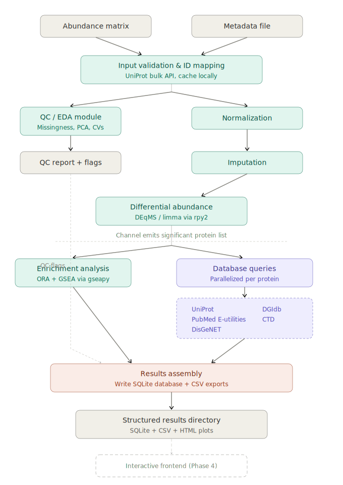

**Last Updated:** 2026-04-01

**Working Project Name:** ProSIFT (PROtein Statistical Integration and Filtering Tool)

**Name Status:** Working name; may be revised before publication. Name collision search conducted 2026-03-20 confirmed no existing bioinformatics tool with this name.

**Purpose:** This document is the cumulative, archival record of the ProSIFT project. It contains all background context, architectural decisions, design rationale, development progress, and detailed explanations. It serves as both a development reference and a record of the reasoning behind every major choice.

---

# 1. Project Overview

## 1.1 Purpose and Motivation

ProSIFT is a pipeline and interactive exploration platform for discovery proteomics data. Its purpose is to take quantitative protein abundance data, run it through quality control, statistical analysis, functional enrichment, and multi-database annotation, and produce comprehensive "protein profiles" that consolidate all available information about each protein into a single, searchable, sortable resource.

The core problem ProSIFT addresses: researchers conducting discovery proteomics experiments typically identify hundreds to thousands of proteins, many of which are differentially abundant across conditions. Evaluating which of these proteins are biologically interesting requires manually querying multiple databases (UniProt, DisGeNET, DGIdb, PubMed, CTD, etc.), cross-referencing enrichment results, and mentally integrating statistical evidence with biological context. This process is time-consuming, error-prone, and difficult to systematize. ProSIFT automates and integrates these steps into a single pipeline with an interactive frontend for exploration.

## 1.2 Target Users and Use Cases

**Primary audience:** The developer's own lab, working with discovery proteomics datasets. The tool is designed with the possibility of broader community adoption if it proves effective, but generalizability is a secondary concern during initial development.

**Typical use case:** A researcher has a quantitative proteomics dataset (tens of samples, thousands of proteins) from a discovery experiment. They want to:

- Assess data quality (missingness, outliers, replicate concordance)
- Identify differentially abundant proteins across conditions
- Run functional enrichment analyses (ORA, GSEA)
- Query external databases for disease associations, druggability, literature co-occurrence, and general protein annotation
- Explore results interactively, sorting/filtering proteins by various criteria (fold change, significance, disease relevance, druggability, literature hits)
- View biological process-level summaries alongside protein-level profiles

## 1.3 Project Scope

**In scope (current vision):**

- Ingestion of protein-level abundance matrices with metadata
- QC/EDA module (missingness analysis, replicate variability, PCA, outlier detection, distributional assessment)
- Imputation with multiple method support and sensitivity diagnostics
- Differential abundance analysis (DEqMS or limma via rpy2)
- Overrepresentation analysis (ORA) and Gene Set Enrichment Analysis (GSEA) via gseapy
- Database integration layer (UniProt, DisGeNET, DGIdb, CTD, PubMed E-utilities)
- Protein profile assembly (compiled SQLite database combining all annotations, statistics, and enrichment results)
- Biological process view (GO/KEGG term-level profiles)
- Interactive frontend for exploration (technology TBD; Shiny for Python under consideration)
- Nextflow-orchestrated pipeline targeting Torque/PBS cluster
- Singularity container for reproducibility

**Explicitly out of scope (current phase):**

- Raw MS spectra processing (no .raw or .mzML ingestion)
- Ingestion modules for specific search engine outputs (MaxQuant, DIA-NN, etc.) -- deferred to later phase
- AWS/cloud deployment
- Multi-organism support (initial development targets mouse proteomics data)

**Future considerations (not committed, but noted for later evaluation):**

- Ingestion modules for common search engine output formats (MaxQuant proteinGroups.txt, DIA-NN report.tsv, FragPipe combined_protein.tsv)
- AlphaFold structure integration
- Reactome pathway integration
- BioGRID protein-protein interaction data
- AWS deployment for hosted access
- Multi-organism support

## 1.4 Existing Tools and Landscape

*Updated 2026-03-23 based on a survey of proteomics analysis platforms and database resources.*

The tools available to a researcher analyzing discovery proteomics data fall into three categories. No existing tool spans all three, which is the gap ProSIFT is designed to fill.

### Category 1: Statistical analysis platforms

These tools accept a protein or peptide abundance table and produce differential expression results, QC diagnostics, and visualizations. This is the most crowded category.

**Perseus** is the dominant platform in this space. It provides normalization, imputation (downshifted normal distribution), statistical testing (t-test, ANOVA with multiple testing correction), PCA, hierarchical clustering, and enrichment analysis. It is tightly integrated with MaxQuant and is the de facto standard for downstream analysis of MaxQuant output. Perseus is a Windows desktop application with a GUI-driven workflow. Its strengths are breadth of functionality, extensive documentation, and community adoption. Its limitations for ProSIFT's purposes: it has no automated multi-database annotation layer (no programmatic querying of DisGeNET, DGIdb, PubMed, CTD), no compiled protein profile output, and no interactive exploration frontend. It also does not run on HPC clusters or in automated pipelines -- it is designed for interactive, manual analysis sessions.

**LFQ-Analyst** is a web application for one-click differential expression analysis of MaxQuant LFQ data. It wraps the DEP R package and produces QC plots, volcano plots, and heatmaps. It is easy to use but restricted to LFQ intensity data from MaxQuant, has limited statistical flexibility (no DEqMS support), and provides no database annotation or protein profiling capabilities.

**ProVision** is a web-based platform for analyzing MaxQuant output (both LFQ and TMT). It provides a guided workflow for filtering, normalization, imputation, and differential expression. It supports interaction with filtering and statistical parameters but only accepts MaxQuant output, lacks QC reports, and has no database integration.

**DEP** (Bioconductor R package) provides a complete workflow for differential enrichment/expression analysis: filtering, normalization (VSN), imputation (with mixed MAR/MNAR support), and limma-based statistical testing. It introduced the operational MNAR classification rule (missing in all replicates of at least one condition) that ProSIFT adopts in Module 03. DEP is well-designed but is an R package, not an end-to-end pipeline, and has no database annotation layer.

**msqrob2** (Bioconductor) takes a peptide-level modeling approach that can outperform protein-level summarization methods for differential expression. It is methodologically sophisticated but specialized -- it addresses the statistics, not the annotation or exploration problem.

**Other tools in this category:** ProStaR (R/Shiny, focused on filtering and imputation diagnostics), Proteus (R package for LFQ analysis), prolfqua (R package with flexible statistical modeling), Eatomics (web-based). A 2023 benchmarking study (Arias-Hidalgo et al., J. Proteome Res.) found that results across these tools can vary significantly depending on parameter choices for imputation, normalization, and statistical testing -- even within the same tool. This underscores the value of ProSIFT's sensitivity analysis approach, where the pipeline reports how results change across methods rather than committing to a single configuration.

**MSstats** deserves separate mention as it is widely used in regulated and clinical proteomics settings. It provides rigorous statistical models for both label-free and labeled experiments and is used in pharmaceutical and clinical research. It is methodologically strong but operates purely at the statistical layer -- no database annotation.

### Category 2: Biological database resources

Individual databases that researchers query manually, one protein at a time or in small batches:

**UniProt** -- the canonical protein database. Provides gene names, function descriptions, subcellular localization, GO annotations, pathway membership, disease associations, and cross-references to other databases. Queried via REST API or bulk download.

**DisGeNET** -- gene-disease association database integrating data from GWAS, animal models, and curated literature. Provides association scores. Heavily human-centric. Requires registration for full API access.

**DGIdb** -- the Drug-Gene Interaction Database. Aggregates drug-gene interactions from over 40 sources into a single queryable resource. Provides druggability annotations, interaction types, and supporting evidence. Available via API and bulk download.

**CTD** -- the Comparative Toxicogenomics Database. Chemical-gene and chemical-disease interactions. Useful for environmental and pharmacological exposure associations. Available via bulk download.

**PubMed (via E-utilities)** -- the biomedical literature. Can be queried programmatically for co-occurrence of a gene symbol with terms of interest, providing a rough measure of how well-studied a protein is in a specific research context.

Each of these databases is valuable individually, but no existing tool queries all of them programmatically for a list of proteins and consolidates the results into a unified, searchable format. A researcher evaluating hundreds of differentially abundant proteins must currently visit each database manually, one protein at a time -- a process that is time-consuming, error-prone, and effectively impossible to do systematically at scale.

### Category 3: Pathway and enrichment tools

Tools like g:Profiler, Enrichr, DAVID, and STRING accept a gene list and return enrichment results, interaction networks, or functional annotations at the gene set level. They are widely used and complement the statistical tools in Category 1. However, they operate at the aggregate level (which pathways are enriched?) rather than providing per-protein annotation profiles (what do we know about this specific protein's disease associations, druggability, and literature context?).

### Where ProSIFT fits

ProSIFT bridges the gap between these three categories. It integrates the statistical analysis pipeline (Category 1), automated multi-database annotation (Category 2), and enrichment analysis (Category 3) into a single end-to-end workflow that produces comprehensive, per-protein profiles compiled into a queryable SQLite database.

The typical workflow without ProSIFT requires a researcher to: (1) run Perseus or a similar tool for differential abundance analysis, (2) take the resulting significant protein list and manually query UniProt, DisGeNET, DGIdb, PubMed, and CTD for each protein, (3) mentally integrate the statistical evidence with the database annotations, and (4) somehow organize all of this into a format that allows sorting, filtering, and comparison. For tens of significant proteins, this is tedious but feasible. For hundreds, it is effectively impossible to do systematically.

ProSIFT automates steps 2-4 and integrates them with step 1. Its unique contributions relative to the existing landscape are:

- **Automated multi-database annotation** as part of the analysis pipeline, not as a separate manual step
- **Per-protein profiles** that consolidate statistical results, QC flags, disease associations, druggability, chemical interactions, and literature co-occurrence into a single searchable record
- **A queryable SQLite results database** that enables sorting and filtering across all annotation dimensions (e.g., "all proteins with FDR < 0.05 and a druggability annotation, sorted by fold change")
- **A biological process view** that aggregates protein-level annotations by GO/KEGG term, allowing exploration by pathway rather than by individual protein
- **Pipeline automation** via Nextflow, enabling reproducible batch execution on HPC infrastructure -- in contrast to the interactive, manual workflows of Perseus and similar tools

ProSIFT is not a replacement for Perseus or any individual statistical tool. Perseus is more mature, more flexible for interactive exploratory analysis, and has a larger community. ProSIFT's value lies in what happens after the statistics: the systematic integration of external knowledge with quantitative results, compiled into a format designed for exploration and prioritization.

---

# 2. Architecture and Design

## 2.1 High-Level System Architecture

ProSIFT is organized into three decoupled layers:

**Layer 1 -- Nextflow Pipeline (compute layer).** Runs on the HPC cluster (Torque/PBS). Handles all computation: ingestion, QC, normalization, imputation, statistical analysis, enrichment analysis, database queries, and profile assembly. Produces a structured results directory.

**Layer 2 -- Structured Results Directory (data contract).** A well-defined directory containing the SQLite results database, CSV exports, and visualization files that serves as the interface between the pipeline and the frontend. The format and organization of this directory constitutes the "contract" between layers 1 and 3 -- either can evolve independently as long as this contract is maintained.

**Layer 3 -- Interactive Exploration Frontend (presentation layer).** Reads the results directory and provides the protein profiles, biological process view, and sortable/filterable database. Technology not yet finalized; Shiny for Python, Streamlit, Panel, or a static HTML approach are under consideration.

**Rationale for this separation:** The pipeline and the frontend serve fundamentally different purposes and have different computational requirements. The pipeline needs cluster resources and runs in batch mode; the frontend needs responsiveness and runs interactively. Decoupling them means: (a) someone can use just the pipeline and explore results in their own way, (b) the frontend can run on a laptop without cluster access, (c) either layer can be replaced or upgraded independently.

## 2.2 Pipeline DAG Overview

The diagram below shows the directed acyclic graph (DAG) of the ProSIFT Nextflow pipeline. Each node represents a major process or process group. Arrows indicate data dependencies (channel connections). Color coding: teal nodes are computational/analytical steps, purple nodes are external database operations, coral is the convergence/assembly step, and gray nodes are inputs or outputs.

{width=100%}

*Figure 1. ProSIFT pipeline DAG showing the dependency structure of all major processing steps. Dashed elements indicate future components (interactive frontend) or long-range dependencies (QC flags feeding into profile assembly). The horizontal dashed line marks the point where the differential abundance process emits a channel of significant protein IDs and downstream processes dynamically fan out. Updated 2026-03-27 to reflect revised module architecture (8 modules, combined normalization/imputation, QC report assembly checkpoint).*

### DAG structure and dependency logic

The pipeline has a clear main spine running down the right side of the diagram: input validation, normalization, imputation, and differential abundance. This is the core statistical path that transforms raw abundance data into a list of differentially abundant proteins with effect sizes and significance values.

Two major branching points structure the rest of the pipeline:

**First fork (after validation):** *Updated 2026-03-27 to reflect revised module architecture.* The pre-normalization QC/EDA module (Module 02) branches off to the left and runs on the validated but un-normalized data. This is intentional -- the pre-normalization QC module needs to assess raw distributional properties (skewness, dynamic range, missingness patterns) before any transformation is applied. The main analytical path continues rightward through Module 03 (Normalization & Imputation), which contains two sequential processes: NORMALIZE and IMPUTE. A QC Report Assembly process then collects diagnostic outputs from Modules 02 and 03 into a consolidated QC report, creating a checkpoint before differential abundance. QC flags from across these modules take a long-range path through the pipeline and are incorporated into protein profiles at the Results Assembly stage.

**Second fork (after differential abundance):** This is the pivot point of the entire pipeline. Everything above it is about producing statistically sound abundance estimates. Everything below it is about interpreting those results. The fork produces two parallel branches:

- **Enrichment analysis (left branch):** ORA and GSEA run against the differential abundance results. These are independent of the database queries and can execute in parallel.
- **Database queries (right branch):** All five external databases (UniProt, PubMed E-utilities, DisGeNET, DGIdb, CTD) are queried for the proteins of interest. Individual database queries are independent of each other and are parallelized both across databases and across proteins.

**Dynamic fanout after differential abundance:** The dashed horizontal line between differential abundance and the two downstream branches marks a critical architectural feature. The list of proteins that need database querying is not known until differential abundance completes (it depends on which proteins pass the significance threshold, though the user can also configure the pipeline to query all detected proteins). In Nextflow, this is handled naturally by the dataflow model: the differential abundance process emits a channel of significant protein IDs, and the downstream database query processes consume from that channel. Each protein ID fans out to all five database query processes in parallel. This scatter-gather pattern is native to Nextflow's channel system and does not require a special checkpoint mechanism (unlike Snakemake, which would need an explicit checkpoint rule).

**Convergence at profile assembly:** The profile assembly step (coral) is the most complex join in the pipeline. It requires inputs from four upstream sources: QC flags, differential abundance results, enrichment results, and all database query outputs. In Nextflow terms, this process collects from multiple input channels, waiting for all upstream processes to complete before writing all results into the SQLite results database and generating the biological process (GO/KEGG term) aggregations.

**Results directory and frontend:** The structured results directory is the terminal output of the Nextflow pipeline and serves as the data contract between the pipeline (Layer 1) and the interactive frontend (Layer 3). The frontend is shown as a dashed outline because it is a Phase 4 deliverable and is architecturally separate from the pipeline. Note that Nextflow also maintains its own internal work directory for intermediate files; the structured results directory is a separate, explicitly published set of outputs intended for consumption by the frontend and by users.

## 2.3 Input Specification

*Updated 2026-03-23 to reflect Phase 1 UniProt-only requirement, add peptide count columns, and note separate-run approach for factorial designs.*

**Primary input (Phase 1):** A protein-level abundance matrix plus a metadata file. For datasets with factorial designs (e.g., multiple brain regions, subcellular fractions, or treatment conditions beyond a simple two-group comparison), the recommended approach is separate ProSIFT runs per comparison context rather than a single combined run. See project history (`proSIFT_project_history.Rmd`) Decision Register entry 2026-03-23 "Separate Runs for Factorial Designs" for rationale.

**Abundance matrix:**

- Format: CSV or TSV
- Rows: proteins (one per row)
- Columns: one protein ID column, then one column per sample containing abundance values, and optionally per-sample peptide count columns
- Protein IDs: UniProt accessions required in Phase 1. For protein group data (common in search engine output), the first semicolon-delimited accession is used as the representative ID. Gene symbol and Ensembl ID input may be supported in future phases. See project history Decision Register entry 2026-03-23 "UniProt Accessions Required for Phase 1."
- Abundance values: can be raw intensities, normalized values, or log-transformed values (pipeline configuration specifies the state of the input data)
- Missing values: represented as NA or empty cells
- Peptide count columns (optional but recommended): per-sample peptide counts used by DEqMS for variance modeling. If absent, the statistical module falls back to limma. See Module 01 spec (`01_input_validation.Rmd`) Section 2.1 for column naming conventions and prefix configuration.

**Metadata file:**

- Format: CSV or TSV
- Rows: one per sample (sample IDs must match column headers in the abundance matrix)
- Columns: sample ID, condition/group, and any additional covariates (batch, replicate number, etc.)
- Must include a column specifying the grouping variable for differential abundance analysis

**Future ingestion modules (not Phase 1):** Will accept structured output from common search engines (MaxQuant, DIA-NN, FragPipe) and transform them into the standardized abundance matrix + metadata format.

## 2.4 File Format Strategy

The following file format strategy was adopted based on a consideration of performance, usability, type safety, queryability, and the needs of both the pipeline (computational) and the frontend (interactive exploration). Updated 2026-03-20 to replace JSON with SQLite as the primary compiled output format.

**Parquet -- internal pipeline intermediates.** Used for all rectangular numerical data passing between Nextflow processes (abundance matrices, statistical results, QC metrics tables). Rationale: columnar storage enables fast analytical queries; built-in type information prevents the type-guessing problems that plague CSVs (e.g., gene name "NA" interpreted as missing, numeric gene IDs interpreted as integers); compressed by default (5-10x smaller than CSV); fast read/write with pandas and pyarrow.

**CSV -- user-facing exports.** Key results tables (differential abundance results, significant protein lists, enrichment results) are also exported as CSV for users who want to open results in Excel or import into other tools. These are "deliverables," not pipeline intermediates.

**SQLite -- compiled results database.** The pipeline's final assembly step writes all results into a single SQLite database file. This is the primary output that the interactive frontend consumes. SQLite replaces the originally planned JSON protein profiles (see project history Decision Register entry dated 2026-03-20). Rationale: SQLite provides indexed, queryable access to all protein data, enabling the frontend to sort, filter, and join across tables (e.g., "all proteins with FDR < 0.05 and druggability annotation, sorted by fold change") without loading everything into memory. It is a single portable file with no server requirement. Python's sqlite3 module is part of the standard library -- no additional dependencies needed. The relational schema naturally represents the one-to-many relationships in protein annotations (one protein has many disease associations, many drug interactions, many literature hits, etc.) without the redundancy that a flat CSV would require or the loading overhead of thousands of individual JSON files. SQL is also a broadly valuable skill in industry.

**YAML/Nextflow config -- configuration.** Pipeline infrastructure configuration (executor, containers, resource limits) is handled by Nextflow's native nextflow.config file. Scientific parameters (contrasts, thresholds, database settings, organism, PubMed search terms) are specified in a separate params file (YAML or JSON) passed via Nextflow's -params-file flag. This separation keeps infrastructure concerns distinct from scientific concerns.

**PNG + interactive HTML (Plotly) -- visualizations.** Static PNGs for archival and documentation; interactive HTML plots for the exploration frontend (hover for values, zoom, pan, toggle traces). Both produced from the same underlying data.

**JSON -- limited role.** JSON is retained for API response caching (storing raw database query responses during pipeline execution) and for the params file if YAML is not preferred. It is no longer the format for protein profiles or the frontend's data source.

## 2.5 Configuration Schema

*Updated 2026-03-20 to reflect Nextflow's dual configuration model.*

Pipeline configuration is split into two files, separating infrastructure concerns from scientific parameters:

**nextflow.config -- infrastructure configuration.** Managed by Nextflow's native configuration system. Handles:

- Executor settings (PBS/Torque queue, local, or cloud)
- Container directive (Singularity image path)
- Resource defaults per process (CPUs, memory, time limits)
- Retry and error handling strategies
- Work directory location
- Profiles for different execution environments (e.g., a "cluster" profile and a "local" profile)

This file follows nf-core conventions where practical, making the pipeline recognizable to the Nextflow community.

**params.yml -- scientific parameters.** A YAML file passed to Nextflow via the `-params-file` flag. Contains all parameters that control what analysis is performed and how. The schema is not yet finalized but will include at minimum:

- Project: name, organism (mouse/human), description
- Input: paths to abundance matrix and metadata file, file format, protein ID column name, protein ID type, abundance data state (raw/log2/normalized)
- Experimental design: group column, contrasts to test, covariates, batch column
- QC: missingness thresholds, CV thresholds, minimum samples per group, outlier detection settings
- Normalization: method (median/quantile/vsn/none), log transformation toggle
- Imputation: method (minprob/knn/left_censored/none), method-specific parameters, sensitivity analysis toggle
- Differential abundance: method (deqms/limma), FDR threshold, fold change threshold. Peptide count columns auto-detected by prefix (no user configuration). Contrasts specified as explicit numerator_vs_denominator strings.
- Enrichment: ORA/GSEA toggles, gene set libraries, background definition
- Database queries: which databases to enable, API keys, PubMed search terms of interest, cache lifetime
- Output: results directory path

**[FOLLOW-UP NEEDED]** Finalize exact params.yml schema during Phase 1 implementation. Draft a nextflow.config with PBS executor profile.

## 2.6 ID Mapping Strategy

*Updated 2026-03-20 with expanded details on many-to-many handling, ortholog mapping, and mapping table schema. Updated 2026-03-23 to note Phase 1 UniProt-only simplification. Updated 2026-04-01 to condense implementation details into Module 01 spec.*

**Phase 1 simplification:** The pipeline requires UniProt accessions as input in Phase 1 (see project history Decision Register entry 2026-03-23). This simplifies the ID mapping step since the source IDs are already in UniProt's native format -- the mapping is essentially a cross-reference lookup rather than a translation. Support for gene symbol or Ensembl ID input may be added in a future phase; the architecture supports this without redesign (just adding the corresponding UniProt API "from" type).

Protein ID mapping is handled centrally at the start of each pipeline run using UniProt's ID mapping API. The pipeline queries UniProt once in bulk for all protein IDs in the input dataset and caches the resulting mapping table locally. This mapping table is then used by every downstream module that needs to translate between ID types (e.g., UniProt accessions for database queries, gene symbols for enrichment analysis, Entrez IDs where needed).

**Why centralized mapping matters:** ID mapping is one of the most common sources of silent data loss in proteomics pipelines. Proteins can be identified by many different naming systems (UniProt accessions, gene symbols, Entrez IDs, Ensembl IDs), and none of them map cleanly to each other. Gene symbols are organism-specific (mouse Tp53 vs. human TP53), change over time, and can be ambiguous. If each module independently resolves IDs using different methods or resources, inconsistencies arise: a protein's QC flags might not correctly associate with its enrichment results in the final profile. Centralizing the mapping produces a single source of truth used everywhere.

**Why UniProt as the mapping authority:** UniProt is the canonical protein database and maintains cross-references to essentially every other biological identifier system (Entrez, Ensembl, KEGG, PDB, Reactome, etc.). Its ID mapping API accepts bulk queries (thousands of IDs in one request) and returns mappings to any supported target database. For a proteomics pipeline where the input IDs are likely UniProt accessions or gene symbols, UniProt is the most natural authority. Alternatives considered: biomaRt (Ensembl-centric, less natural for protein-level data), local mapping files from NCBI/UniProt (large files, staleness risk), g:Profiler (web service dependency), and manual mapping tables (don't scale).

### Many-to-many mapping handling

ID mapping is not always one-to-one. Edge cases (isoform collapse, merged/redirected accessions, unmapped IDs) are handled explicitly with status tracking rather than silent dropping. The mapping table records a status for each input protein (mapped, unmapped, isoform_collapsed, accession_redirected, multiple_mappings), ensuring that downstream modules and the user can identify and investigate any mapping issues. See Module 01 spec (`01_input_validation.Rmd`) Sections 4.5-4.6 for the full handling rules and mapping status definitions.

### Ortholog mapping (mouse to human)

For mouse proteomics data queried against human-centric databases (DisGeNET, PubMed human literature), a second layer of ID mapping is required:

- **Layer 1:** Input protein IDs (mouse UniProt accessions) to mouse gene symbols and other mouse IDs. Source: UniProt ID mapping API.
- **Layer 2:** Mouse gene symbols to human ortholog gene symbols. Source: Ensembl BioMart ortholog tables (preferred for currency and comprehensiveness) or JAX MGI (authoritative for mouse genetics). HomoloGene was considered but has not been updated since 2014.

The ortholog mapping introduces genuine biological uncertainty. Not all protein functions are conserved between mouse and human orthologs. However, since ProSIFT's primary use case is identifying candidates for human therapeutics, users understand that annotations from human-centric databases (DGIdb, DisGeNET) are about the human ortholog. Rather than flagging every annotation as ortholog-inferred, ortholog status is tracked at the protein level: the mapping table includes ortholog identifiers and a mapping status field. Proteins with no human ortholog have empty DGIdb and DisGeNET results, and the ortholog_mapping_status field explains why. (See project history Decision Register entry dated 2026-03-21 for full rationale.)

**PubMed queries** use both the mouse gene symbol and the human ortholog symbol, since relevant literature may use either. Results are labeled with which symbol generated the hit.

**[FOLLOW-UP NEEDED]** Select the ortholog mapping resource (Ensembl BioMart vs. JAX MGI) and implement the Layer 2 mapping during Phase 3.

### Mapping table output

The mapping module produces a single table (Parquet file) with one row per input protein ID. Key columns include the original input ID, canonical UniProt accession, mouse gene symbol, Entrez and Ensembl IDs, human ortholog identifiers (when available), mapping status, and free-text notes for edge cases. Every downstream module reads this table and joins it with its input data to get the IDs it needs: the enrichment module uses gene_symbol_mouse, the PubMed module uses both mouse and human ortholog symbols, and DGIdb/DisGeNET use the human ortholog Entrez ID (skipped for proteins with no ortholog). See Module 01 spec (`01_input_validation.Rmd`) Section 4.8 for the full column schema.

### Caching strategy

The mapping table is cached locally as a Parquet file after the initial API call. If the pipeline is re-run on the same dataset with the same parameters, the cached mapping is reused without an API call. Cache lifetime is configurable (default 30 days), after which the mapping is regenerated to pick up any updates in UniProt's cross-references. See Module 01 spec Section 4.9 for cache key implementation.

## 2.7 Inter-Module Data Contracts

*Added 2026-04-04.*

Each entry below defines the data artifacts that flow between a producer module and its downstream consumer(s). These contracts are the authoritative reference for file names, schemas, join keys, and edge cases at module boundaries. For full output descriptions within a single module, see the corresponding module spec (Section 2, I/O).

**Conventions:**

- `{run_id}` is the user-specified run identifier from `params.yml`.
- All Parquet files use `protein_id` (the first UniProt accession from a semicolon-delimited protein group) as the primary join key unless otherwise noted.
- For 6 accession-redirected proteins per run in the benchmark dataset, `protein_id` (the input accession) differs from `uniprot_accession` (the canonical accession after redirect). Downstream joins must use `protein_id`, not `uniprot_accession`.

### Module 01 --> Module 02

**Producer:** FILTER_PROTEINS, UNIPROT_MAPPING

**Consumer:** Pre-Normalization QC/EDA process(es)

**Primary data artifacts:**

- `{run_id}.filtered_matrix.parquet`: post-detection-filter abundance data (~8,500-8,800 proteins x 6 samples per run, plus peptide count columns). Produced by FILTER_PROTEINS.
- `{run_id}.id_mapping.parquet`: protein ID mapping table (10 columns: protein_id, uniprot_accession, gene_symbol_mouse, entrez_id_mouse, ensembl_gene_mouse, human_ortholog_symbol [null], human_ortholog_entrez [null], ortholog_mapping_status [null], mapping_status, mapping_notes). One row per protein. Produced by UNIPROT_MAPPING.

**Also available (diagnostic, not primary):** validation_report_part1.txt, validation_report_part2.txt, validation_report_part3.txt, published to `results/{run_id}/validation/` but not consumed by downstream processes.

**Note:** `detection_filter_table.csv` was previously diagnostic-only but is now also a primary analytical input for the IMPUTE process (MNAR/MAR classification). See Module 01 --> Module 03 IMPUTE contract below.

### Module 01 --> Module 03 NORMALIZE

**Producer:** FILTER_PROTEINS, VALIDATE_INPUTS

**Consumer:** NORMALIZE

**Primary data artifacts:**

- `{run_id}.filtered_matrix.parquet`: same as Module 02 input. The main analytical spine passes through Module 03, not Module 02 (Module 02 branches off for QC without modifying data).
- `{run_id}.validated_metadata.parquet`: sample-to-group assignments.

**Note:** Module 02's outputs (sample_flags, QC report) are diagnostic and do not feed into Module 03. The data flowing to Module 03 is the same filtered matrix from Module 01.

### Module 01 --> Module 03 IMPUTE

**Producer:** FILTER_PROTEINS

**Consumer:** IMPUTE

**Primary data artifact:**

- `{run_id}.detection_filter_table.csv`: per-protein filter status (PASSED, SINGLE-GROUP, SPARSE, ABSENT) and per-group detection counts. Used for MNAR/MAR classification: SINGLE-GROUP = MNAR, PASSED with missing values = MAR.

**Note:** This file was previously diagnostic-only. It is now a primary analytical input because the DEP-style mixed imputation classification maps directly to Module 01's filter categories.

### Module 03 NORMALIZE --> Module 03 IMPUTE

**Producer:** NORMALIZE

**Consumer:** IMPUTE

**Primary data artifact:**

- `{run_id}.normalized_matrix.parquet`: approximately log2-scale, normalized abundance data. Same shape as filtered matrix. Peptide count columns passed through unchanged. Missing values remain NaN.

**Data scale:** Always approximately log2, regardless of normalization method.

### Module 03 IMPUTE --> Module 04

**Producer:** IMPUTE

**Consumer:** DIFFERENTIAL_ABUNDANCE

**Primary data artifact:**

- `{run_id}.imputed_matrix.parquet`: fully imputed, approximately log2-scale, normalized. No NaN values. Contains abundance columns (`abundance_{sample_id}`) and peptide count columns (`peptide_count_{sample_id}`, int64, zeros at imputed positions). This is the analysis-ready matrix.

**Additional inputs from Module 01:**

- `{run_id}.validated_metadata.parquet`: sample-to-group assignments (from VALIDATE_INPUTS).
- `{run_id}.id_mapping.parquet`: protein IDs and gene symbols (from UNIPROT_MAPPING).

### Module 04 --> Module 05

**Producer:** DIFFERENTIAL_ABUNDANCE

**Consumer:** ENRICHMENT

**Primary data artifact:**

- `{run_id}.diff_abundance_results.parquet`: 14-column results table (see Module 04 spec Section 4.5). One row per protein per contrast. All proteins included regardless of significance.

**Consumer usage:** GSEA uses the full ranked list ranked by `deqms_t` (default). ORA filters to proteins where `significant == True`. Gene symbols come from the `gene_symbol` column already present in this table.

### Module 05 --> Module 07

**Producer:** ENRICHMENT

**Consumer:** Results Assembly (not yet designed)

**Primary data artifacts:**

- `{run_id}.enrichment_results.parquet`: 13-column unified results table (one row per term per analysis type per contrast). Schema: term_id, term_name, library, analysis_type, contrast, pvalue, adj_pvalue, enrichment_score, odds_ratio, combined_score, gene_set_size, overlap_size, overlap_genes.
- `{run_id}.protein_term_mapping.parquet`: 8-column many-to-many protein-term table. Schema: gene_symbol, protein_id, term_id, term_name, library, in_significant_set, is_leading_edge, contrast.

**Join keys:** `protein_id` (protein_term_mapping back to all other tables); `term_id` (enrichment_results to protein_term_mapping).

### Module 04 --> Module 06

**Producer:** DIFFERENTIAL_ABUNDANCE

**Consumer:** Database Queries (not yet designed)

**Primary data artifact:**

- `{run_id}.diff_abundance_results.parquet`: same file as Module 05 input.

**Consumer usage:** Filters to significant proteins, or uses all proteins if `databases.query_scope = "all"`.

### Module 03 --> QC Report Assembly

**Producer:** NORMALIZE and IMPUTE

**Consumer:** QC Report Assembly process (not yet implemented)

**Diagnostic artifacts from NORMALIZE:**

- `{run_id}.postnorm_boxplots` (PNG + HTML)
- `{run_id}.postnorm_pca_scatter` (PNG + HTML)
- `{run_id}.postnorm_correlation_heatmap` (PNG + HTML)
- `{run_id}.postnorm_pca_results.parquet`
- `{run_id}.postnorm_correlation_matrix.parquet`
- `{run_id}.cv_summary.parquet` + `.csv`
- `{run_id}.normalization_summary.txt`

**Diagnostic artifacts from IMPUTE:**

- `{run_id}.imputation_distributions` (PNG + HTML)
- `{run_id}.imputation_fractions` (PNG + HTML)
- `{run_id}.imputation_summary.parquet` + `.csv`
- `{run_id}.imputation_summary.txt`

**Note:** Post-normalization plots mirror Module 02's pre-normalization plots for before/after comparison.

---

# 3. Module Specifications

Each subsection follows a consistent structure: purpose, inputs, outputs, key process steps, design decisions summary, and current status. For full process-level specifications, output schemas, parameter tables, and edge case handling, see the corresponding module spec file.

## 3.0 Input Validation & ID Mapping Module (Module 01)

*Added 2026-04-01. Module 01 content was previously distributed across Sections 2.3, 2.6, and the Decision Register. This section consolidates the module-level overview. See `01_input_validation.Rmd` for the full specification.*

**Purpose:** The entry point of the ProSIFT pipeline. Validates user input files, ensures internal consistency between them, removes proteins with insufficient detection for reliable analysis, maps all protein IDs to standardized identifiers, and produces visual characterizations of data completeness. Everything downstream depends on the validated, filtered, ID-mapped outputs of this module.

**Inputs:** Abundance matrix (CSV/TSV: one row per protein, one column per sample, optionally with per-sample peptide count columns), metadata file (CSV/TSV: one row per sample with group assignments and optional covariates), params.yml (scientific parameters).

**Outputs:** Validated abundance matrix (Parquet), validated metadata (Parquet), detection filter summary table (CSV: one row per input protein with filter status), ID mapping table (Parquet: one row per protein with all target identifiers), validation report (text summary of all checks, warnings, and filter results), missingness report (HTML with interactive plots characterizing data completeness).

**Key process steps (10 total):**

1. **Validate Matrix** (Process 4.1): Reads the abundance matrix and checks structural integrity -- file readability, column existence, numeric types, no duplicate protein IDs (with protein group handling for semicolon-delimited accessions), no empty rows or columns.
2. **Validate Metadata** (Process 4.2): Reads the metadata file and checks structural integrity -- group column exists with at least two groups, covariate/batch columns exist if specified, no duplicate sample IDs. Runs in parallel with matrix validation (independent checks).
3. **Cross-Validate Samples** (Process 4.3): Joins the validated matrix and metadata, confirming that sample IDs match between files. Samples in one file but not the other are flagged or dropped with warnings. Hard stop if no samples match or any group falls below the minimum sample count.
4. **Filter Low-Detection Proteins** (Process 4.4): Removes proteins with insufficient signal in the run context. A protein passes if detected in at least `qc.min_detections_per_group` replicates (default 2) in at least one group. Proteins are categorized as PASSED, SINGLE-GROUP (detected in one group only, retained as potential biological hits), SPARSE (insufficient detection in all groups, removed), or ABSENT (zero detections, removed). This filter is critical for preventing artificial differential abundance results driven by imputation of proteins with no real signal. It also produces the `detection_filter_table.csv` used by Module 03 for MNAR/MAR imputation classification.
5. **UniProt Bulk ID Mapping** (Process 4.5): Sends all protein IDs to UniProt's bulk API in a single request and returns a mapping table with target identifiers (gene symbols, Entrez IDs, Ensembl IDs). Uses cached results when available. See Section 2.6 for the architectural rationale for centralized mapping.
6. **Handle Mapping Edge Cases** (Process 4.6): Processes many-to-many and failed mappings -- isoform collapse to canonical entries, accession redirects for merged UniProt entries, synonym recording for multiple gene symbols, and flagging of unmapped IDs (which are carried through with empty annotations, never silently dropped).
7. **Ortholog Mapping** (Process 4.7, conditional): Runs only when `project.organism = "mouse"`. Maps mouse gene symbols to human orthologs for downstream querying of human-centric databases (DGIdb, DisGeNET). See Section 2.6 for the two-layer mapping architecture.
8. **Mapping Table Output** (Process 4.8): Assembles the final mapping table with all identifiers, mapping statuses, and ortholog information. This table is consumed by every downstream module.
9. **Cache Mapping Table** (Process 4.9): Writes the mapping table to the local cache for reuse on subsequent runs.
10. **Missingness Report** (Process 4.10): Produces visual characterizations of missingness patterns across the full pre-filter dataset. Four plots: filter category bar chart, per-sample detection bar chart, missingness heatmap for filtered-out proteins, and per-protein missingness rate histogram. This is a reporting-only process with no effect on downstream data flow. Missingness visualization belongs here rather than in Module 02 because Module 01's detection filter removes the proteins with the most informative missingness patterns; by the time Module 02 sees the data, the dramatic patterns have been removed.

**Nextflow implementation:** Four Nextflow processes (VALIDATE_INPUTS, FILTER_PROTEINS, UNIPROT_MAPPING, MISSINGNESS_REPORT). Matrix and metadata validation run in parallel within VALIDATE_INPUTS. Cross-validation is the join point. All validation errors produce hard stops with descriptive messages.

**CTXcyto benchmark results:** 8,948 input proteins; 8,779 retained (98.1%), 169 removed (114 absent, 55 sparse); 237 flagged as single-group detection. Pre-filter missingness: 5.9% overall. All 12 CTX/Synaptosome runs validated successfully.

**Design decisions:** 6 module-internal decisions documented in Module 01 spec Section 5 (parallel validation, hard stop on errors, UniProt accession requirement, abundance_type parameter retention, detection filter parameter as integer, missingness visualization scope). Cross-cutting decisions (separate runs for factorial designs, ortholog tracking strategy) are in the project history (`proSIFT_project_history.Rmd`) Decision Register.

**Status:** Design complete; implemented and tested as of 2026-03-27.

## 3.1 Pre-Normalization QC/EDA Module (Module 02)

*Updated 2026-03-27. Rescoped from monolithic QC/EDA to pre-normalization QC only. Fully designed and implemented. See `02_qc_eda.Rmd` for the detailed spec.*

**Purpose:** Characterize the distributional properties of the post-filter abundance data and the relationships between samples before any normalization or imputation. Produces the "before" picture; Module 03's NORMALIZE process produces the "after."

**Inputs:** Filtered abundance matrix (Parquet, from Module 01 FILTER_PROTEINS), validated metadata (Parquet, from Module 01 VALIDATE_INPUTS), ID mapping table (Parquet, from Module 01 UNIPROT_MAPPING).

**Outputs:** Per-sample summary table (Parquet + CSV: n_detected, median_intensity, total_intensity, mad_intensity, skewness, kurtosis), sample flag summary table (Parquet + CSV: 4 boolean flags + n_flags count), correlation matrix (Parquet), PCA results (Parquet), 5 plot types (PNG + interactive HTML), pre-normalization QC report (HTML).

**Key analyses (6 total):**

1. **Per-sample intensity summaries:** Detection count, median intensity, total intensity (raw scale only), MAD, skewness, kurtosis per sample.
2. **Intensity distribution box plots:** One box per sample, colored by group, log2 scale.
3. **Q-Q plot:** Overlaid Q-Q plot for all samples against a theoretical normal distribution, colored by group.
4. **PCA (pre-normalization):** PC1 vs. PC2, complete cases only, centered and scaled, colored by group with variance explained in axis labels.
5. **Sample-to-sample correlation heatmap:** Pearson on log2 data, pairwise-complete, observed-range color scale, grouped by condition.
6. **Outlier detection (convergent evidence):** Four boolean flags per sample (low detection, extreme median, PCA distance, low within-group correlation) with n_flags count. Advisory only -- no samples excluded.

**Scope boundary:** This module operates only on post-filter, pre-normalization data. Missingness analysis is handled by Module 01 (which has access to the pre-filter data where the dramatic patterns live). CV, post-normalization diagnostics, and imputation diagnostics are produced by Module 03. See `02_qc_eda.Rmd` Section 4 for the full scope rationale.

**Implementation:** Single Nextflow process (PRENORM_QC) calling `bin/prenorm_qc.py`. No new parameters (reads `input.abundance_type` and `design.group_column` from existing params). If `abundance_type` is `raw`, applies log2(x+1) internally for visualization only.

**CTXcyto benchmark results:** 8,403 proteins, 6 samples, medians ~23 log2, skewness near zero, PCA PC1 51.7% / PC2 29.6%, WT and KO separate on PC1, within-group correlations 0.99+, CTXcyto_KO-2 flagged on 2 criteria (extreme_median + pca_outlier).

**Status:** Design complete; implemented and tested as of 2026-03-27.

## 3.2 Normalization & Imputation Module (Module 03)

*Updated 2026-03-27. Originally split into separate normalization (Module 03) and imputation (Module 04) modules, then recombined after evaluating that the split added wiring complexity without meaningful benefit. See project history Decision Register entry 2026-03-27 "Combined Normalization and Imputation Module."*

**Purpose:** Transform the filtered abundance data into a fully analysis-ready matrix: log2-transformed, normalized, and imputed. Also compute per-protein CV on normalized pre-imputation data.

**Two Nextflow processes within this module:**

- **NORMALIZE** (`bin/normalize.py`): log2 transformation (method-aware), normalization, post-normalization diagnostic plots, CV computation.
- **IMPUTE** (`bin/impute.py`): MNAR/MAR classification, imputation, imputation diagnostic plots.

**Normalization methods:**

- **Median normalization** (default): shifts sample log2 distributions to a common median. Simple, robust, pure Python.
- **Quantile normalization:** forces all distributions identical. More aggressive. Pure Python.
- **VSN (variance stabilizing normalization):** operates on raw intensities (not log2), applies arcsinh-based transformation. Accessed via R/Bioconductor through rpy2. Refuses non-raw data with a clear error. Most statistically rigorous; used by DEP and the CTX Wistar core analysis.
- **None:** log2-only (if raw) or pass-through.

**Log2 handling:** Method-aware (Option B). Median/quantile receive log2(x)-transformed data. VSN receives raw data. Transformation uses log2(x), not log2(x+1).

**Imputation (DEP-style mixed, default):** MNAR values (SINGLE-GROUP proteins from Module 01's filter) get MinProb imputation (low-end draw). MAR values (sporadic missingness in PASSED proteins) get KNN imputation (similar-protein average). Classification uses Module 01's detection_filter_table.csv directly. User can override with single-method mode (uniform MinProb, KNN, or left-censored/Perseus-style).

**CV computation:** True CV (SD/mean) on back-transformed linear scale (2^log2_value), per protein per group, on observed values only. Sits between normalization and imputation.

**Diagnostic outputs:** Post-normalization box plots, PCA, correlation heatmap (mirroring Module 02's formats via shared `bin/prosift_plot_utils.py`). Post-imputation observed vs. imputed distribution plot, per-sample imputation fraction bar chart, imputation summary.

**Key parameters:** `normalization.method` (default: median), `imputation.mode` (default: mixed), `imputation.mnar_method` (default: minprob), `imputation.mar_method` (default: knn). See `03a_normalization_imputation.Rmd` for full parameter table (11 parameters).

**Status:** Design complete; implemented and tested as of 2026-03-30. Full pipeline test (Modules 01-03) passed on all 12 CTX/Synaptosome runs.

## 3.3 QC Report Assembly

*Updated 2026-03-27. Section renumbered from 3.4. References updated to reflect combined Module 03.*

**Purpose:** Collect diagnostic outputs from Modules 02 and 03 and compile them into a single consolidated QC report. This creates a natural checkpoint in the pipeline: the researcher reviews data quality before differential abundance, enrichment, and database queries run.

**Inputs:** Diagnostic outputs from Module 02 (pre-normalization QC), Module 03 NORMALIZE process (post-normalization diagnostics, CV summary), Module 03 IMPUTE process (imputation diagnostics).

**Outputs:** Consolidated QC report (HTML). This is a presentation/compilation step with no analytical logic.

**Report structure (preliminary):**

- Section 1: Missingness overview (from Module 01 MISSINGNESS_REPORT)
- Section 2: Distributional assessment (from Module 02) with pre- vs. post-normalization comparison (from Module 03 NORMALIZE)
- Section 3: PCA (pre-normalization from Module 02, post-normalization from Module 03 NORMALIZE)
- Section 4: Sample correlation (pre- and post-normalization)
- Section 5: Replicate variability / CV distributions (from Module 03 NORMALIZE)
- Section 6: Imputation diagnostics (from Module 03 IMPUTE)
- Section 7: Sample and protein flags summary

**Nextflow implementation:** A lightweight process that takes channels from Modules 02 and 03, waits for all to complete, and runs a compilation script. No analytical computation.

**Status:** Not yet implemented.

## 3.4 Differential Abundance Module (Module 04)

*Renumbered 2026-03-27 from Section 3.5 / Module 05. Updated 2026-03-30 with completed design specification.*

**Purpose:** Identify differentially abundant proteins between conditions and provide robust statistical measures of significance and effect size. This is the pivot point of the pipeline: everything upstream prepares the data; everything downstream interprets the results. The module emits the full results table for downstream consumption by both the enrichment module (GSEA needs the full ranked list, ORA filters to significant) and the database query module (filters to significant proteins or queries all, depending on configuration).

**Inputs:** Imputed abundance matrix (Parquet, from Module 03 IMPUTE, log2-scale, no NaN, includes peptide count columns), validated metadata (Parquet, from Module 01), ID mapping table (Parquet, from Module 01), contrast specification and parameters from params.yml.

**Outputs:** Differential abundance results table (Parquet + CSV, 14 columns: protein_id, gene_symbol, log2_fc, avg_abundance, limma_t, limma_pvalue, limma_adj_pvalue, deqms_t, deqms_pvalue, deqms_adj_pvalue, n_peptides, significant, direction, contrast). Volcano plots, MA plots (PNG + interactive Plotly HTML, one per contrast). Human-readable summary text file. All published to `results/{run_id}/differential_abundance/`.

**Single Nextflow process:** DIFFERENTIAL_ABUNDANCE. Statistics and visualizations bundled together (consistent with NORMALIZE and IMPUTE). Implemented as `bin/differential_abundance.py` using rpy2 inline for the R statistical calls (consistent with Module 03's VSN approach).

**Statistical pipeline (via rpy2):**

The R-side workflow is a four- or five-step chain depending on whether peptide counts are available:

1. `model.matrix(~ 0 + group)` -- build a means-model design matrix from metadata
2. `lmFit(abundance_matrix, design)` -- fit a linear model per protein
3. `contrasts.fit(fit, contrast_matrix)` -- apply the user-specified contrast
4. `eBayes(fit)` -- empirical Bayes variance shrinkage (limma's core contribution: borrows variance estimates across all proteins to stabilize per-protein estimates, particularly important with small n)
5. `spectraCounteBayes(fit)` -- DEqMS peptide-count correction (conditions the variance prior on each protein's peptide count, so proteins measured by more peptides get less shrinkage and proteins measured by fewer get more)

When peptide counts are unavailable (or `method = "limma"` is specified), step 5 is skipped and limma p-values become the primary significance measure. DEqMS-specific output columns are set to null.

**Peptide count handling:** Per-sample peptide count columns (`peptide_count_{sample_id}`, int64) are carried through from DIA-NN output through Modules 01-03. Values of 0 correspond to imputed positions. DEqMS requires a single integer per protein: the module computes the minimum of nonzero values across all samples for each protein. This captures worst-case real measurement precision. No protein can have all-zero counts because Module 01's detection filter removes ABSENT proteins. Auto-detected by scanning for columns matching the `peptide_count_` prefix (no user configuration needed).

**Contrast specification:** Contrasts use the `numerator_vs_denominator` format in params.yml (e.g., `"KO_vs_WT"`). The numerator is the group of interest: positive fold change means higher abundance in the numerator. Parsed by splitting on `_vs_`; both terms validated against the metadata group column at runtime. Multiple contrasts per run are supported. Group names (WT, KO, cyto, synap, CTX, HIP) are the short names from the metadata, not the full run-prefixed names.

**Significance calling:** A protein is significant if its primary adjusted p-value (DEqMS-corrected when available, limma otherwise) falls below `fdr_threshold` (default 0.05) AND the absolute log2 fold change exceeds `fc_threshold` (default 1.0; set to 0 to disable). Direction is "up" (positive FC, significant), "down" (negative FC, significant), or "ns."

**Visualizations:** Volcano plot (-log10 adjusted p-value vs. log2 fold change) and MA plot (log2 fold change vs. average abundance), both with three-color significance scheme (up, down, ns) and threshold lines. No labels on static PNG; hover text on interactive HTML shows protein_id, gene_symbol, fold change, and adjusted p-value.

**Design decisions:** See Module 04 spec (04_differential_abundance.Rmd Section 5) for 9 documented decisions including: rpy2 inline over subprocess R script, peptide count summarization via min-of-nonzero, contrast format and validation, retention of both limma and DEqMS statistics, full results table emission, single process, and limma fallback built now.

**Known limitations:** Statistical power constrained by small sample sizes (n=3 per group in benchmark). Imputed values treated as real measurements by limma/DEqMS, which inflates fold change estimates for proteins with heavy MNAR imputation. Multiple testing correction with ~8,000 proteins is conservative. See Module 04 spec Section 7 for full discussion.

**Status:** Design complete (2026-03-30). Implementation next.

## 3.5 Enrichment Analysis Module (Module 05)

*Renumbered 2026-03-27 from Section 3.6 / Module 06. Content unchanged except for module number references.*

**Purpose:** Identify biological pathways, processes, and functional categories that are overrepresented among differentially abundant proteins (ORA) or show coordinated changes across the ranked protein list (GSEA).

**Inputs:** Differential abundance results table (for both ORA and GSEA). For ORA: a list of significant proteins and a background/universe set. For GSEA: a ranked list of all proteins (typically by signed log10 p-value or log2 fold change).

**Outputs:** Enrichment results tables (Parquet + CSV), enrichment dot plots, GSEA running enrichment score plots (PNG + interactive HTML).

**Tools/Libraries:** gseapy (Python wrapper for GSEA algorithm, also supports ORA).

**Gene set libraries:** Default set includes GO Biological Process, GO Molecular Function, GO Cellular Component, KEGG pathways, and Reactome pathways. Additional libraries configurable via YAML.

**Design decisions:**

- Both ORA and GSEA are run because they answer complementary questions. ORA asks "are significant proteins enriched for a particular function?" but depends on an arbitrary significance cutoff. GSEA uses the full ranked list and can detect coordinated changes in a pathway even if no individual protein crosses the significance threshold.
- Background/universe for ORA: by default, all proteins detected in the dataset (not the entire proteome), since the set of detectable proteins is already biased by the experimental method.

**Known limitations:** Enrichment results are sensitive to the background set definition and to the quality of gene set annotations. GO annotations are biased toward well-studied organisms and proteins. Results should be interpreted as hypothesis-generating, not confirmatory.

**Status:** Not yet implemented.

## 3.6 Interactive Frontend (Module 08)

*Renumbered 2026-03-27 from Section 3.7 / Module 09. Content unchanged except for module number references. Targeted for Phase 4.*

**Purpose:** Provide an interactive environment for exploring pipeline results, including a sortable/filterable protein database, individual protein profile pages, and a biological process view.

**Technology:** Not yet finalized. Candidates under evaluation:

- **Shiny for Python:** Closest equivalent to R Shiny, which is familiar in the bioinformatics community. Still maturing; smaller extension ecosystem compared to R Shiny.
- **Streamlit:** Simple, rapid prototyping. Less flexible for complex multi-page layouts.
- **Panel (HoloViz):** More flexible than Streamlit, good for dashboards.
- **Static HTML + JavaScript:** Self-contained output, no server needed. Most portable but less interactive. Potential use of AG Grid or DataTables.js for the sortable table.

**Key design features:**

- **Protein database view:** Sortable, filterable table of all proteins with key metrics (fold change, adjusted p-value, disease interaction score, druggability, literature co-occurrence score). Users can sort by any column to find proteins matching their criteria of interest.
- **Protein profile pages:** Per-protein comprehensive view consolidating abundance statistics, QC flags, differential abundance results, disease associations, druggability annotations, literature hits, functional annotations, and any available structural information. The "baseball card" concept.
- **Biological process view:** Term-level profiles (GO/KEGG) aggregating the proteins annotated to each term, their collective behavior in the dataset, and enrichment statistics. Allows searching by pathway/process rather than by protein.

**Data access:** The frontend reads from the SQLite results database (`prosift_results.db`). Every user interaction -- filtering, sorting, switching between protein and process views -- maps to a SQL query. This means the frontend does not need to hold all protein data in memory; it queries what it needs on demand. All candidate frontend technologies (Shiny, Streamlit, Panel, static HTML with JavaScript) can interface with SQLite easily. Python's built-in sqlite3 module handles server-side frameworks; for static HTML, sql.js (a JavaScript SQLite implementation compiled to WebAssembly) enables client-side queries directly in the browser.

**Deployment considerations:** The pipeline runs on an HPC cluster (Torque/PBS); the frontend should not require cluster resources. Current architectural plan: the pipeline produces the structured results directory (anchored by the SQLite database), and the frontend reads it. The frontend can run on a laptop, a lab server, or be containerized. This decoupling means the frontend is a "viewer" that does no computation.

**[FOLLOW-UP NEEDED]** Select frontend technology after Phase 2, when the results data structure is more concrete and the interactive requirements are better understood.

**Status:** Not yet implemented. Targeted for Phase 4.

---

# 4. Database Integration Layer

This section documents each external database queried by ProSIFT, including what information is extracted, API details, rate limiting considerations, and data freshness strategy.

## 4.1 General Architecture

The database integration layer queries multiple external databases for each protein of interest. During pipeline execution, individual database responses are cached locally as JSON files. At the profile assembly step, all cached results are consolidated and written into the SQLite results database. Two strategies are employed depending on the database:

- **Bulk local download:** For databases with stable, periodic releases (UniProt, CTD, DGIdb), periodic bulk downloads are stored locally and queried without network access. Faster, more reliable, not subject to rate limits.
- **API queries:** For databases where recency matters (PubMed E-utilities) or where bulk download is impractical or restricted (DisGeNET), per-protein API calls are used with caching and rate limiting.

**Caching strategy:** All API responses are cached locally (keyed by protein ID and query parameters) to avoid redundant network requests across pipeline runs. Cache invalidation is time-based (configurable; default 30 days).

**Error handling:** API failures (timeouts, rate limit hits, server errors) are logged and retried with exponential backoff. Proteins for which a database query fails are flagged in the output rather than causing the pipeline to halt.

## 4.2 UniProt

**What it provides:** General protein information -- gene name, protein name, function description, subcellular location, tissue expression, GO annotations, pathway membership, protein-protein interactions, disease associations, and cross-references to other databases.

**Access method:** UniProt REST API for initial bulk ID mapping; UniProt bulk download (Swiss-Prot XML or flat files) for annotation retrieval.

**Rate limits:** UniProt's REST API is generous but should not be abused. Bulk download is preferred for annotation retrieval.

**Data freshness:** UniProt releases are updated approximately every 8 weeks. Local copies should be updated periodically.

**Priority:** High -- this is the foundational annotation source. Implemented first.

## 4.3 PubMed E-utilities

**What it provides:** Literature co-occurrence counts. For each protein, the pipeline queries PubMed for the co-occurrence of the protein name/gene symbol with user-defined terms of interest (e.g., protein + "stroke," protein + "ketamine" + "TBI"). This provides a rough measure of how well-studied a protein is in the context of the user's research area.

**Access method:** NCBI E-utilities API (ESearch endpoint). Requires an API key for higher rate limits.

**Rate limits:** 3 requests/second without API key; 10 requests/second with API key. For thousands of proteins and multiple search terms, this is a bottleneck. Parallelization within rate limits and caching are essential.

**Data freshness:** High value in recency -- literature is continuously published. API queries are the correct approach here (not bulk download).

**Important caveat -- normalization:** Raw co-occurrence counts are heavily biased by how well-studied a protein is overall. TP53 will co-occur with almost any disease term simply because it has ~100,000 publications. Normalization is required. Options under consideration:

- Normalize by total publication count for that protein (co-occurrence count / total protein publications)
- Pointwise mutual information (PMI): measures whether the co-occurrence is higher than expected by chance given the individual frequencies of the protein and the search term
- Both metrics may be reported to give users different perspectives

**[FOLLOW-UP NEEDED]** Select and validate a normalization approach for PubMed co-occurrence scores.

**Priority:** High -- this provides unique value that no other database offers in an automated way.

## 4.4 DisGeNET

**What it provides:** Gene-disease associations with association scores. Useful for identifying proteins with known links to diseases of interest.

**Access method:** DisGeNET REST API. Requires registration for full access; the public API has restricted query limits.

**Rate limits:** The public API is quite restricted. Full academic access requires registration and an API key.

**Data freshness:** DisGeNET integrates data from multiple sources and is updated periodically. Local caching with periodic refresh is appropriate.

**Licensing note:** DisGeNET has specific licensing terms for academic and commercial use. Terms should be reviewed before any distribution of the tool.

**Priority:** High.

## 4.5 DGIdb (Drug Gene Interaction Database)

**What it provides:** Druggability annotations -- whether a protein is a known drug target, what drugs interact with it, and interaction types. Useful for identifying proteins that could be therapeutically actionable.

**Access method:** DGIdb API or bulk data download.

**Rate limits:** Generally permissive.

**Data freshness:** Updated periodically. Bulk download is appropriate.

**Priority:** High.

## 4.6 CTD (Comparative Toxicogenomics Database)

**What it provides:** Chemical-gene interactions and chemical-disease associations. Useful for identifying environmental or pharmacological exposures associated with proteins of interest.

**Access method:** Bulk data download (CTD provides downloadable datasets).

**Rate limits:** Not applicable for bulk download.

**Data freshness:** CTD is updated monthly. Periodic re-download is appropriate.

**Priority:** Medium -- useful but less commonly needed than disease and druggability annotations.

## 4.7 Results Database Schema (SQLite)

The pipeline's final assembly step writes all results into a single SQLite database file (e.g., `prosift_results.db`). This replaces the originally planned per-protein JSON profiles (see project history Decision Register). The relational schema represents the one-to-many relationships in protein annotations naturally via separate tables joined on protein_id. Preliminary schema (will be refined during implementation):

**Core tables:**

- **proteins** -- one row per protein. Primary table. Columns include: protein_id (PRIMARY KEY), gene_symbol_mouse, entrez_id_mouse, protein_name, organism, function_description, subcellular_location, human_ortholog_symbol, human_ortholog_entrez, ortholog_mapping_status (one_to_one, one_to_many, no_ortholog), fold_change, pvalue, adj_pvalue, mean_abundance_group1, mean_abundance_group2, qc_flag_missingness, qc_flag_cv, qc_flag_outlier, imputation_fraction. Indexed on protein_id, adj_pvalue, fold_change for fast filtering and sorting.

- **sample_abundances** -- one row per protein-sample combination. Columns: protein_id (FOREIGN KEY), sample_id, abundance, group, is_imputed. Enables per-sample access for detailed profile views.

**Annotation tables (one-to-many with proteins):**

- **disease_associations** -- DisGeNET results. Only populated for proteins with a human ortholog. Columns: protein_id, disease_id, disease_name, association_score, evidence_source.

- **drug_interactions** -- DGIdb results. Only populated for proteins with a human ortholog. Columns: protein_id, drug_name, interaction_type, source.

- **chemical_interactions** -- CTD results. Queried for all proteins. Columns: protein_id, chemical_name, chemical_id, interaction_type.

- **literature_hits** -- PubMed co-occurrence results. Queried for all proteins (using mouse symbol; also human ortholog symbol when available). Columns: protein_id, search_term, raw_count, total_protein_publications, normalized_score, query_gene_symbol, query_date.

- **uniprot_annotations** -- Extended UniProt data. Queried for all proteins directly with mouse accessions. Columns: protein_id, tissue_expression, pathway_membership, cross_references.

**Enrichment tables:**

- **enrichment_results** -- one row per tested term. Columns: term_id, term_name, library (GO_BP, GO_MF, GO_CC, KEGG, Reactome), pvalue, adj_pvalue, odds_ratio, combined_score, analysis_type (ORA or GSEA), leading_edge_size.

- **protein_terms** -- many-to-many mapping between proteins and GO/KEGG terms. Columns: protein_id, term_id, is_leading_edge (for GSEA). Enables both protein-to-terms and term-to-proteins lookups.

**Design notes:**

- Ortholog information is tracked at the protein level (human_ortholog_symbol, human_ortholog_entrez, ortholog_mapping_status in the proteins table), not as per-annotation flags. The tool's primary use case is identifying candidates for human therapeutics; users understand that annotations from DGIdb and DisGeNET are about the human ortholog. Proteins with no human ortholog have empty disease_associations and drug_interactions tables, and the ortholog_mapping_status field explains why.
- Database query gating rule: UniProt, PubMed, and CTD query all proteins regardless of ortholog status. DGIdb and DisGeNET query only proteins where human_ortholog_symbol is not null.
- Indexes are created on protein_id in all tables (for fast profile assembly) and on adj_pvalue, fold_change, and association_score in their respective tables (for fast sorting/filtering in the frontend).
- The schema is designed so that a protein profile page is assembled by querying `proteins` for the core row and then LEFT JOINing each annotation table on protein_id. The biological process view is assembled by querying `enrichment_results` joined to `protein_terms` joined to `proteins`.

**[FOLLOW-UP NEEDED]** Finalize exact column definitions, data types, and index strategy during Phase 3 implementation when the actual database response structures are known.

---

# 5. Infrastructure and Deployment

## 5.1 Cluster Configuration

*Updated 2026-03-25 -- SSH survey of cluster completed. Supersedes 2026-03-23 entry.*

ProSIFT is designed to run on the mesx.sdsu.edu HPC cluster, which uses Torque/PBS as its job scheduler (not SLURM as originally assumed). Nextflow supports PBS natively via the `pbspro` executor, handling job submission, resource allocation, and dependency management through its configuration system.

**Target cluster details (confirmed 2026-03-25 via SSH survey):**

- Host: mesx.sdsu.edu
- OS: Oracle Linux Server 8.10, x86_64
- Job scheduler: Torque 6, binaries at `/usr/local/torque6/bin` (on PATH)
- User home: `/home2/rhastings` (2.5 TB available)
- Scratch: `/usr/scratch2/userdata2/rhastings` (11 TB available)
- Conda: miniconda3 25.1.1 at `/home2/rhastings/miniconda3`; Python 3.12.9 in base
- Java: not installed system-wide (will be installed via `openjdk=17` in prosift conda env)
- Nextflow: not installed (will be installed via conda)
- R: not installed (will be installed via conda)
- Git: not installed (not needed -- rsync workflow; see development workflow in Handoff Section 8.2)
- Singularity/Apptainer: not installed; deferred to later phase

**Nextflow PBS integration:** Each Nextflow process specifies resource requirements (CPUs, memory, time) via process directives or in nextflow.config. Nextflow translates these into PBS qsub directives automatically when the `pbspro` executor is selected. Nextflow monitors job status, handles retries for failed jobs, and manages the work directory where intermediate files are staged.

**Development workflow:** Code is developed locally (macOS) and synced to the cluster via rsync over SSH for execution. Git is used locally only, for tracking meaningful milestones -- not for shuttling changes between machines. See Handoff File Section 8.2 for rsync commands and operational details.

## 5.2 Singularity/Apptainer Container

**Purpose:** Package the complete software environment (OS, Python, R, all dependencies) into a single portable, reproducible image file (.sif). Ensures the pipeline runs identically regardless of the host system's software configuration.

**Why Singularity, not Docker:** Docker requires root privileges, which are not available (and generally not permitted for security reasons) on shared HPC clusters. Singularity (now Apptainer) runs without root, integrates with PBS/Torque and shared filesystems, and respects the cluster's user permission model.

**How it works in practice:** A Singularity definition file specifies a base OS image (e.g., Ubuntu 22.04), installs Python 3.11+, R, and all required packages. This is built into a .sif file (typically done on a machine with root access or via a remote build service). The .sif file is copied to the cluster and referenced in Nextflow process directives or in nextflow.config via the `container` directive. Nextflow automatically handles bind-mounting data directories and executing inside the container when the Singularity engine is enabled.

**Key detail:** Singularity containers are read-only at runtime. The pipeline's code and libraries inside the container cannot be modified during execution. Data is read from and written to the host filesystem via bind mounts. This is a feature: the container provides a stable, immutable environment, and data lives outside it.

**Build workflow:**

1. Develop and test locally or in a Conda environment
2. Write Singularity definition file capturing all dependencies with pinned versions
3. Build .sif image (on a machine with root access, or via Sylabs Cloud remote build)
4. Test pipeline inside container
5. Version the .sif file alongside the codebase

**[FOLLOW-UP NEEDED]** Write the Singularity definition file during Phase 1 once the dependency list is established.

## 5.3 Conda Environment

During development (before the Singularity container is finalized), a Conda environment specification (environment.yml) manages dependencies. This also serves as the source of truth for what goes into the Singularity image.

## 5.4 Directory Structure

*Updated 2026-03-27 to reflect implemented modules and combined normalization/imputation.*

The project directory follows nf-core conventions:

- `main.nf` -- pipeline entry point
- `nextflow.config` -- infrastructure config (params defaults, executor profiles, tracing)
- `conf/base.config` -- per-process resource allocations and error strategy
- `workflows/prosift.nf` -- top-level workflow (samplesheet parsing, channel wiring, module orchestration)
- `modules/local/{process_name}/main.nf` -- individual Nextflow process definitions
- `bin/` -- Python scripts called by Nextflow processes (executable, on PATH during execution)
- `scripts/` -- data preparation scripts (outside the pipeline, not called by Nextflow)
- `prosift_inputs/` -- master abundance file, per-run metadata/params, samplesheet (not committed to git)
- `results/{run_id}/validation/` -- Module 01 published outputs (6 files per run, plus missingness report when implemented)
- `results/{run_id}/qc/` -- Module 02 published outputs (17 files per run: data parquets, plots, report)
- `results/{run_id}/normalization_imputation/` -- Module 03 published outputs (not yet implemented)
- `results/pipeline_info/` -- Nextflow execution trace, timeline, and report
- `project_documentation/` -- master doc, handoff, module docs in `modules/` subdirectory

See the Handoff File (Section 7) for the current detailed file system map.

---

# 6. Development Roadmap

## 6.1 Phase 1 -- Core Pipeline Skeleton and Pre-Normalization QC

*Updated 2026-03-27 to reflect rescoped QC/EDA module and implementation progress.*

**Goal:** Establish the Nextflow workflow structure, input format specification, ID mapping layer, and pre-normalization QC module. Produce a working pipeline that takes an abundance matrix + metadata, runs validation, maps IDs, and produces a pre-normalization QC report characterizing data quality before any analytical transformations.

**Deliverables:**

- Project directory structure and repository initialization (following nf-core conventions where applicable)
- nextflow.config with PBS executor profile, container directive, and parameter defaults
- params.yml for scientific parameters (contrasts, thresholds, database settings)
- Input validation process (Nextflow process)
- UniProt ID mapping module (bulk API call + local cache)
- Pre-normalization QC/EDA module (Module 02) with: per-sample intensity summaries, intensity distribution box plots, Q-Q plot, pre-normalization PCA, sample-to-sample correlation heatmap, convergent-evidence outlier detection
- Pre-normalization QC report generation (HTML with interactive plots)
- Missingness report visualizations (Module 01 Process 4.10): filter category bar chart, per-sample detection bar chart, missingness heatmap for filtered-out proteins, missingness rate histogram
- Conda environment.yml
- Singularity definition file (initial version)

**Status:** Complete as of 2026-03-27. All Module 01 processes (4.1-4.10) implemented and tested. Module 02 (Pre-Normalization QC/EDA) implemented and tested. Full pipeline verified on all 12 CTX/Synaptosome runs. Remaining from original deliverables: Singularity definition file (deferred, low priority; dependency list established).

## 6.2 Phase 2 -- Normalization, Imputation, Statistical Analysis, and Enrichment

*Updated 2026-03-27. Normalization and imputation are combined in Module 03 (two processes: NORMALIZE, IMPUTE) with DEP-style mixed imputation, CV computation between them, and diagnostic outputs for both. QC Report Assembly compiles all diagnostics into a checkpoint report.*

**Goal:** Build the full analytical workflow from normalization through enrichment. Module 03 handles normalization, CV, and imputation in two sequential processes. A consolidated QC report is assembled after Module 03 as a checkpoint before statistical testing.

**Deliverables:**

- Module 03: Normalization & Imputation
  - NORMALIZE process: method-aware log2 + median/quantile/VSN/none normalization, post-normalization diagnostic plots (box plots, PCA, correlation heatmap via shared plot utilities), CV computation on back-transformed linear scale
  - IMPUTE process: DEP-style mixed imputation (MNAR via MinProb, MAR via KNN, classification from Module 01 detection_filter_table.csv), imputation diagnostics (observed vs. imputed distributions, imputation fractions), single-method override available
- QC Report Assembly: collects diagnostic outputs from Modules 02 and 03, compiles consolidated HTML QC report as pre-statistical-analysis checkpoint
- Module 04: Differential Abundance (DEqMS via rpy2, with limma as alternative), volcano plots, MA plots
- Module 05: Enrichment (ORA and GSEA via gseapy), enrichment dot plots, GSEA running score plots

**At end of phase:** A pipeline that goes from abundance matrix to differentially abundant proteins with enrichment results, with a consolidated QC report at the midpoint. Useful as a standalone analytical tool.

**Status:** In progress. Module 03 (Normalization & Imputation) complete as of 2026-03-30: both NORMALIZE and IMPUTE processes implemented, standalone-tested, and verified on all 12 runs in a full end-to-end pipeline test (Modules 01-03). Module 04 (Differential Abundance) design complete as of 2026-03-30: full spec written (04_differential_abundance.Rmd). Implementation next. QC Report Assembly and Module 05 (Enrichment) not yet started.

## 6.3 Phase 3 -- Database Integration Layer

**Goal:** Build the multi-database querying infrastructure and protein profile assembly.

**Deliverables:**

- Caching and rate-limiting framework
- UniProt annotation retrieval module
- PubMed E-utilities query module with normalization
- DisGeNET query module
- DGIdb query module
- CTD query module
- SQLite results database assembly (schema design, table creation, index optimization)
- Biological process (GO/KEGG term) aggregation queries

**Risks:** This phase carries the most technical risk due to external API dependencies, rate limiting, and the complexity of integrating heterogeneous data sources. UniProt and PubMed should be implemented first (most stable API, highest unique value respectively).

**Status:** Not yet started.

## 6.4 Phase 4 -- Interactive Frontend

**Goal:** Build the exploration interface.

**Deliverables:**

- Protein database view (sortable/filterable table)
- Protein profile pages
- Biological process view
- Frontend technology selection and implementation

**Status:** Not yet started.

## 6.5 Deferred / Future Considerations

The following ideas have been discussed and noted but are explicitly not committed to any phase. They are recorded here so they are not lost.

- **Ingestion modules** for MaxQuant, DIA-NN, FragPipe output formats (Phase 2+)
- **Input usability simplification** -- current workflow requires 3 preprocessing scripts + samplesheet + per-run params/metadata before pipeline runs. Acceptable for development; not suitable for bench scientists. The usability layer sits entirely outside the pipeline (above the input format contract) and can be rewritten at any point without touching Nextflow files or Python scripts. Options evaluated: merge preprocessing scripts into one, build ingestion into Nextflow itself, auto-detect comparisons from sample names. (Added 2026-03-26)
- **SQLite compiled database** as backend for frontend queries (Phase 4+)
- **AWS deployment** for hosted access if the tool gains community adoption
- **AlphaFold integration** for structure thumbnails in protein profiles
- **Reactome** pathway-level integration
- **BioGRID** protein-protein interaction data
- **Multi-organism support** beyond mouse (e.g., human, rat)

---

# 7. Testing and Validation

*Updated 2026-03-23 to identify the CTX/Synaptosome dataset as the Phase 1 benchmark.*

## 7.1 Benchmark Dataset

**CTX/Synaptosome Proteomics Dataset (Blanco-Suarez Lab, Wistar project 25-L185).** This dataset serves as the primary test case for Phase 1 development. It is well-suited for validation because the developer has deep familiarity with the data, the experimental design, and the expected results from the Wistar core's independent analysis.

**Dataset characteristics:** 8,948 filtered protein groups from DIA-NN v2.2.0 search of mouse cortex and hippocampus (synaptosomes and cytosol fractions), 2x2x2 factorial design (genotype x region x fraction), 24 total samples (n=3 per group), CHRDL1 knockout vs. wild-type. Raw ion intensities with 7.5% overall missingness. Per-sample stripped sequence counts available for DEqMS.

**Test configuration:** Four separate ProSIFT runs, one per region/fraction combination (CTXcyto, CTXsynap, HIPcyto, HIPsynap), each a simple 6-sample KO vs. WT comparison. This tests ProSIFT's two-group design with real data at realistic scale.

**Validation approach:** Compare ProSIFT's differential abundance results (DEqMS, separate-run normalization) against the Wistar core's results (moderated t-test, combined normalization across all 24 samples). The two analyses use different statistical methods and different normalization contexts, so exact agreement is not expected. However, the significant protein lists should show substantial overlap. Large discrepancies warrant investigation. Expected significant protein counts from the core's analysis: CTXcyto ~838, CTXsynap ~526, HIPcyto ~475, HIPsynap ~260.

## 7.2 Per-Module Validation

*[To be populated as modules are implemented.]*

## 7.3 Known Issues and Bugs

*[To be populated during development.]*

---

# 8. Known Limitations and Caveats

## 8.1 Tool-Level Limitations

- **Input scope:** ProSIFT currently accepts only protein-level abundance matrices. It cannot assess upstream data quality issues that may be visible at the peptide or PSM level but are hidden after protein rollup.
- **Organism assumption:** Initial implementation targets mouse proteomics data. ID mapping, gene set libraries, and database queries are configured for mouse proteins (Mus musculus). Multi-organism support would require parameterizing these components. Human-centric databases (DGIdb, DisGeNET) are queried via human orthologs where available; proteins with no human ortholog will have empty disease association and druggability sections. UniProt, PubMed, and CTD are queried for all proteins regardless of ortholog status.
- **External database dependencies:** Results depend on the completeness and accuracy of external databases (UniProt, DisGeNET, DGIdb, CTD, PubMed). Well-studied proteins will have richer profiles than understudied ones, introducing an inherent bias toward known biology.
- **Literature co-occurrence is not causation:** PubMed co-occurrence scores measure how often a protein appears in the literature alongside a term of interest. This is a measure of existing research attention, not of biological relevance. Highly studied proteins will score higher regardless of their actual importance to the user's research question.

## 8.2 Statistical Limitations

- **Sample size constraints:** With tens of samples, statistical power for detecting small effect sizes is limited. The empirical Bayes framework (DEqMS/limma) helps by borrowing information across proteins, but it cannot fully compensate for small sample sizes.
- **Imputation assumptions:** All imputation methods make assumptions about the missing data mechanism. MNAR-aware methods (MinProb, left-censored) assume that missing values correspond to low-abundance proteins, which is generally but not always true in MS proteomics.
- **Multiple testing:** With thousands of proteins tested, multiple testing correction is essential but conservative. Some truly differentially abundant proteins may not reach significance after correction.

---

# 9. Project History Reference

The Decision Register (all significant methodological, architectural, and design decisions with full rationale) and the Development Log (chronological record of substantive work sessions) have been moved to a dedicated history document: `proSIFT_project_history.Rmd`.

This separation keeps the master doc focused on the current state of the project (what ProSIFT is and how it works), while the history doc provides the full chronological record of how the project reached that state. Key architectural decisions are summarized in context throughout this document (Sections 2-5) where they are most relevant to understanding the current design.

**Document tiers:**

- **This document** (`proSIFT_master_doc.Rmd`): Current-state reference. Architecture, module summaries, infrastructure, roadmap, testing, limitations, references.
- **Project history** (`proSIFT_project_history.Rmd`): Chronological record. Decision Register and Development Log. Append-only.
- **Module specs** (`01_input_validation.Rmd`, `02_qc_eda.Rmd`, etc.): Per-module implementation detail. Process specs, output schemas, parameter tables, edge cases, and module-internal design decisions.

---

# 10. References and Resources

## 10.1 Key Papers

*[To be populated as the project progresses. Will include citations for:]*

- DEqMS methodology
- limma methodology
- GSEA methodology
- Imputation methods for proteomics (MNAR-aware approaches)
- DisGeNET, DGIdb, CTD database publications
- Arias-Hidalgo et al. (2023) "LFQ-Based Peptide and Protein Intensity Differential Expression Analysis" J. Proteome Res. 22:2114-2123 -- benchmarking study comparing Perseus, LFQ-Analyst, ProVision, msqrob2, ProStaR, Proteus, prolfqua, and Eatomics. Referenced in Section 1.4.
- Lazar et al. (2016) "Accounting for the Multiple Natures of Missing Values in Label-Free Quantitative Proteomics Data Sets to Compare Imputation Strategies" J. Proteome Res. -- foundational paper on MNAR/MAR imputation strategies. Referenced in Module 03 imputation design (DEP-style mixed imputation).

## 10.2 Databases and Tools

| Resource | URL | Purpose in ProSIFT | Access Notes |
|---|---|---|---|
| UniProt | https://www.uniprot.org/ | ID mapping, protein annotation | REST API + bulk download |
| PubMed E-utilities | https://www.ncbi.nlm.nih.gov/books/NBK25501/ | Literature co-occurrence | API key recommended for higher rate limits |
| DisGeNET | https://www.disgenet.org/ | Gene-disease associations | Registration required for full API access |
| DGIdb | https://www.dgidb.org/ | Druggability, drug-gene interactions | API + bulk download |
| CTD | https://ctdbase.org/ | Chemical-gene interactions | Bulk download |
| gseapy | https://gseapy.readthedocs.io/ | ORA and GSEA | Python package |
| Nextflow | https://www.nextflow.io/ | Pipeline orchestration | Groovy-based DSL |
| nf-core | https://nf-co.re/ | Community pipeline standards and tools | Nextflow ecosystem |
| Singularity/Apptainer | https://apptainer.org/ | Container runtime | Available on most HPC clusters |

## 10.3 Collaborators

| Role | Name | Affiliation | Contact | Contribution |
|---|---|---|---|---|
| Developer | Reina Hastings | | reinahastings13@gmail.com | Sole developer |
| | | | | |

*[Add collaborators, advisors, lab members, or other contributors as the project progresses.]*

---

# 11. Instructions for Claude

This section governs how Claude should interact with this document across sessions. These rules apply whenever this document is provided as context.

## 11.1 Core Editing Rules

**This document is a living current-state reference.** All sections (1-10) may be updated in place when new information refines or extends what is already there. Always date significant updates. When updating, Claude must preserve existing information and details. If a section needs revision, annotate the change with the date and reason rather than silently overwriting.

**The Decision Register and Development Log live in a separate document** (`proSIFT_project_history.Rmd`). New design decisions and development work should be logged there, not here. See Section 9 of this document for the full document tier description.

## 11.2 Section-Specific Behavior

**Living sections** (Sections 1-5, 7, 8, 10) may be updated in place when new information refines or extends existing content. Date significant updates.

**Section 6 (Roadmap)** is a hybrid. Phase descriptions and deliverable lists are living text that can be refined. Status fields are updated as phases progress. Completed phases should not have their original scope rewritten -- instead, note what was actually delivered versus what was planned.

**Section 9 (Project History Reference)** is a pointer to the history document and should not need frequent updates.

## 11.3 What Claude Should Always Do

- **Date everything.** Every significant update gets a date.
- **Document the "why."** Never record a methodological or design choice without its rationale. If the rationale is uncertain, say so explicitly rather than omitting it.
- **Flag uncertainty.** If Claude is not confident in a technical claim, architectural recommendation, or biological inference, it must say so clearly. Use language like "tentative," "requires validation," or "assuming X holds" rather than presenting uncertain conclusions as settled.
- **Flag follow-ups.** If work in a session reveals something that needs future attention, note it explicitly with a **[FOLLOW-UP NEEDED]** tag so it is not lost between sessions.
- **State limitations proactively.** When recording design decisions, include caveats and known limitations in the same entry rather than deferring them exclusively to Section 8.
- **Maintain consistency.** If a decision recorded in the project history contradicts content in this document, surface the contradiction and update the relevant sections to reflect the current state.
- **Log decisions and dev work in the right place.** New design decisions go in `proSIFT_project_history.Rmd` Section 1 (Decision Register). Development session summaries go in Section 2 (Development Log). Module-internal decisions go in the relevant module spec's Design Decisions section.

## 11.4 What Claude Should Never Do

- **Never silently overwrite content.** If something needs to change, the change and its reason must be visible.
- **Never fabricate citations or database details.** If Claude is unsure whether an API endpoint, rate limit, or database feature is correct, it must flag the uncertainty rather than stating it as fact.
- **Never omit caveats to make the tool sound more capable.** This document is an internal development record, not a marketing document. Honest assessment serves the developer better than clean narratives.
- **Never assume context not present in this document.** If Claude needs information that is not here (e.g., cluster configuration details, specific dataset characteristics, API key availability), it should ask rather than guess.

## 11.5 Tone and Voice

This document should read as the working notebook of a careful developer-researcher. Write in a direct, precise, academic style. Avoid hedging where the evidence is clear, but be explicit about uncertainty where it exists. No filler, no fluff, no motivational framing. The goal is a record that the developer can trust as accurate and complete.

## 11.6 Handling Conflicts

If the user states something in conversation that contradicts what is recorded in this document or the project history, Claude should surface the contradiction rather than silently going along with either version. The document may be outdated, or the user may be misremembering -- either way, the discrepancy deserves attention.

## 11.7 When This Document Is Not Provided

If a session involves project-relevant work but this document was not uploaded, Claude should remind the user that updates may need to be logged here and/or in the project history afterward. Claude should not attempt to reconstruct or update this document from memory alone.
